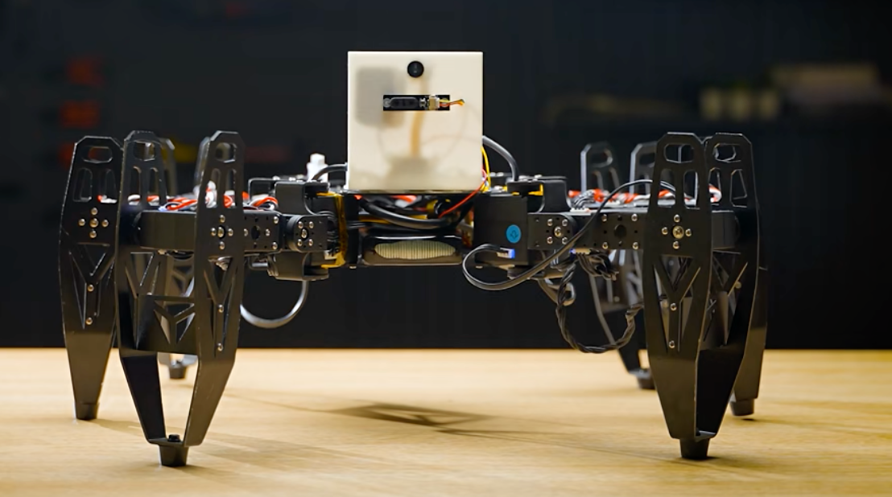

[English](./README_hexapod_en.md) | 简体中文

# AI 聊天六足机器人



基于 T5-Core 开发板的 AI 智能聊天六足机器人项目，结合涂鸦 AI 聊天机器人与18路总线舵机六足机器人，实现语音控制机器人运动，单条语音下发多条指令可以通过workq顺序执行。

## 📋 项目简介

本项目是 [your_chat_bot](https://github.com/tuya/TuyaOpen/tree/master/apps/tuya.ai/your_chat_bot) 的扩展版本，在原有 AI 智能对话功能的基础上，增加了六足机器人运动控制功能。通过语音或 APP 控制六足机器人执行前进、后退、转向、跳舞、挥手等动作。

### 主要特性

- 🤖 **AI 智能对话**：支持语音识别和智能对话
- 🦿 **六足运动控制**：支持多种运动姿态（前进、后退、左转、右转、跳舞、挥手、站立、蹲下）
- 📱 **APP 远程控制**：通过涂鸦智能 APP 实时控制机器人
- 🎤 **语音唤醒**：支持语音唤醒和按键唤醒
- 🔊 **语音播报**：AI 回复通过语音播放

## 🏗️ 系统架构

```
┌─────────────────────────────────────────────────────────────┐
│                      涂鸦智能 APP                            │
│              (运动控制 / AI 角色切换 / 音量调节)              │
└───────────────────────────┬─────────────────────────────────┘
                            │ MQTT
                            ▼
┌─────────────────────────────────────────────────────────────┐
│                    T5-Core 开发板                            │
│  ┌─────────────┐  ┌─────────────┐  ┌─────────────────────┐  │
│  │  AI 聊天模块 │  │  语音处理模块 │  │  六足运动控制模块    │  │
│  └─────────────┘  └─────────────┘  └──────────┬──────────┘  │
│                                               │              │
└───────────────────────────────────────────────┼──────────────┘
                                                │ UART (115200)
                                                ▼
┌─────────────────────────────────────────────────────────────┐
│                    总线舵机控制板                             │
│                    (18路舵机控制)                             │
└───────────────────────────┬─────────────────────────────────┘
                            │
                            ▼
┌─────────────────────────────────────────────────────────────┐
│                      六足机器人                              │
│                   (18个总线舵机)                             │
└─────────────────────────────────────────────────────────────┘
```

## 🔧 硬件依赖

### 必需硬件

| 硬件 | 说明 |
| --- | --- |
| T5-Core 开发板 | [T5-E1-IPEX 开发板文档](https://developer.tuya.com/cn/docs/iot-device-dev/T5-E1-IPEX-development-board?id=Ke9xehig1cabj) |
| 六足机器人套件 | 18路总线舵机六足机器人 |
| 总线舵机控制板 | 支持总线舵机协议的控制板 |
| 麦克风 | 用于语音采集 |
| 喇叭 | 用于语音播放 |

### 接线说明

| T5-Core 引脚 | 连接设备 | 说明 |
| --- | --- | --- |
| UART0 TX | 舵机控制板 RX | 串口发送 |
| UART0 RX | 舵机控制板 TX | 串口接收 |
| GND | 舵机控制板 GND | 共地 |

> ⚠️ **注意**：舵机控制板需要独立供电，18个舵机同时工作需要较大电流。

## 📐 运动姿态数据生成

本项目的运动姿态数据（`move_ctrl.h`）是通过 **hexapod-irl** 六足机器人控制系统生成的。

### 姿态生成工具

- **项目地址**：[hexapod-irl (适配总线舵机版本)](https://github.com/robeortZ/hexapod-irl)
- **原始项目**：[Mithi's hexapod-irl](https://github.com/mithi/hexapod-irl)

### 生成流程

```
┌─────────────────┐     ┌─────────────────┐     ┌─────────────────┐
│  React 前端应用  │ --> │  步态算法生成    │ --> │  舵机角度数据    │
│  (3D 可视化)     │     │  (运动学计算)    │     │  (move_ctrl.h)  │
└─────────────────┘     └─────────────────┘     └─────────────────┘
```

### 角度系统说明

本项目使用的总线舵机角度范围为 **0-270 度**，默认中间位置为 **135 度**（对应 PWM 值 1500）。

**角度与 PWM 值对应关系**：
- PWM 500 → 0 度
- PWM 1500 → 135 度（中间位置）
- PWM 2500 → 270 度

### 舵机编号分布

六足机器人共有 6 条腿，每条腿 3 个舵机（髋部、大腿、小腿），共 18 个舵机：

```
        前方
    ┌─────────┐
  1-3         4-6
    │  机身   │
  7-9         10-12
    │         │
 13-15       16-18
    └─────────┘
```

详细说明请参考：[六足运动姿态生成工具使用说明.md](./六足运动姿态生成工具使用说明.md)

## 🦿 支持的运动动作

| 动作 | 枚举值 | 说明 |
| --- | --- | --- |
| 空闲 | `MOVE_STATE_IDLE` | 待机状态 |
| 前进 | `MOVE_STATE_FORWARD` | 向前行走 |
| 后退 | `MOVE_STATE_BACKWARD` | 向后行走 |
| 左转 | `MOVE_STATE_TURN_LEFT` | 原地左转 |
| 右转 | `MOVE_STATE_TURN_RIGHT` | 原地右转 |
| 跳舞 | `MOVE_STATE_DANCE` | 跳舞动作 |
| 挥手 | `MOVE_STATE_SHAKE_HANDS` | 挥手动作 |
| 站立 | `MOVE_STATE_STAND` | 站立姿态 |
| 蹲下 | `MOVE_STATE_SIT` | 蹲下姿态 |
| 回正 | `MOVE_STATE_RESET` | 恢复初始姿态 |

## 📡 舵机控制协议

### 单舵机控制命令

```
#<ID>P<PWM>T<TIME>!

参数说明：
- ID: 舵机编号 (001-018)
- PWM: PWM值 (0500-2500)
- TIME: 执行时间 (0001-9999ms)

示例：#001P1500T0100!  // 控制1号舵机转到1500位置，执行时间100ms
```

### 多舵机同步控制命令

```
{#001P1500T0100!#002P1500T0100!...#018P1500T0100!}

使用大括号包裹多个舵机命令，实现同步控制
```

### 读取舵机状态

```
#<ID>PRAD!

返回格式：#<ID>P<PWM>!
```

### 释放所有舵机

```
#255PULK!
```

## 📦 编译与烧录

### 1. 环境准备

确保已安装 TuyaOpen 开发环境，详见 [TuyaOpen 文档](https://github.com/tuya/TuyaOpen)。

### 2. 配置选择

```bash
# 进入项目目录
cd apps/tuya.ai/your_chat_bot_hexapod

# 选择配置（根据实际硬件选择）
tos.py config choice

# 修改配置（可选）
tos.py config menu
```

### 3. 编译

```bash
tos.py build
```

### 4. 烧录

```bash
tos.py flash
```

## 📱 APP 控制

### DP 点说明

| DP ID | 名称 | 类型 | 说明 |
| --- | --- | --- | --- |
| 3 | 音量 | Value | 音量控制 (0-100) |
| 8 | 运动状态 | Enum | 控制机器人运动动作 |
| 101 | 运动步数 | Value | 设置运动执行步数 |

### 运动状态枚举值

```
0 - 空闲 (none)
1 - 前进 (forward)
2 - 后退 (backward)
3 - 左转 (left)
4 - 右转 (right)
5 - 跳舞 (dance)
6 - 挥手 (handshake)
7 - 站立 (stand)
8 - 蹲下 (sit)
9 - 回正 (reset)
```

## 📁 项目结构

```
your_chat_bot_hexapod/
├── src/                        # 主程序源码
│   ├── tuya_main.c            # 主入口
│   └── ...
├── robot_ctl_src/              # 六足机器人控制源码
│   ├── uart_servo_ctrl.c      # 舵机串口控制
│   ├── uart_servo_ctrl.h      # 舵机控制头文件
│   └── move_ctrl.h            # 运动姿态数据表
├── include/                    # 头文件目录
├── assets/                     # 资源文件
├── config/                     # 配置文件
├── script/                     # 脚本文件
├── CMakeLists.txt             # CMake 配置
├── Kconfig                    # Kconfig 配置
└── README_hexapod.md          # 本文档
```

## 🔗 相关资源

- [TuyaOpen SDK](https://github.com/tuya/TuyaOpen)
- [hexapod-irl (运动姿态生成工具)](https://github.com/robeortZ/hexapod-irl)
- [hexapod-kinematics-library (运动学计算库)](https://github.com/mithi/hexapod-kinematics-library)
- [T5-Core 开发板文档](https://developer.tuya.com/cn/docs/iot-device-dev/T5-E1-IPEX-development-board?id=Ke9xehig1cabj)
- [涂鸦 IoT 开发平台](https://platform.tuya.com/)

## ⚠️ 注意事项

1. **电源供应**：18个舵机同时工作需要足够的电流，建议使用独立电源供电
2. **首次调试**：建议先断开舵机电源，确认角度数据正确后再连接
3. **舵机保护**：注意舵机的角度限制，避免过度旋转损坏舵机
4. **串口占用**：确保 UART0 没有被其他设备占用

## 📞 技术支持

如遇到问题，请检查：
1. 串口连接是否正确
2. 舵机控制板是否正常供电
3. 编译日志中的错误信息
4. APP 端 DP 下发是否正常

---

**版本**：1.0.1  
**最后更新**：2024

