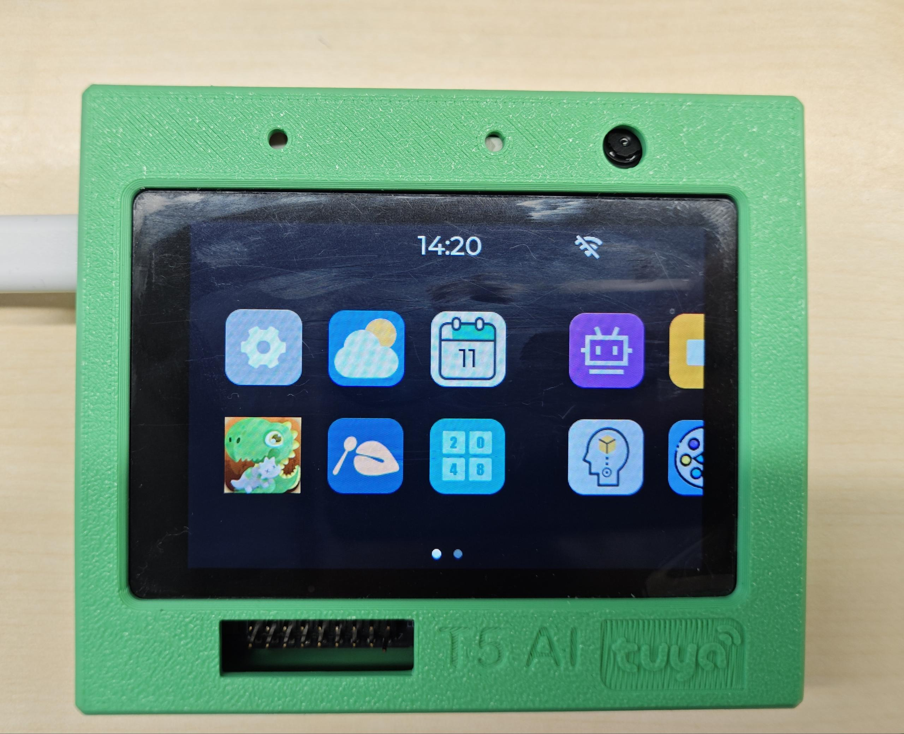
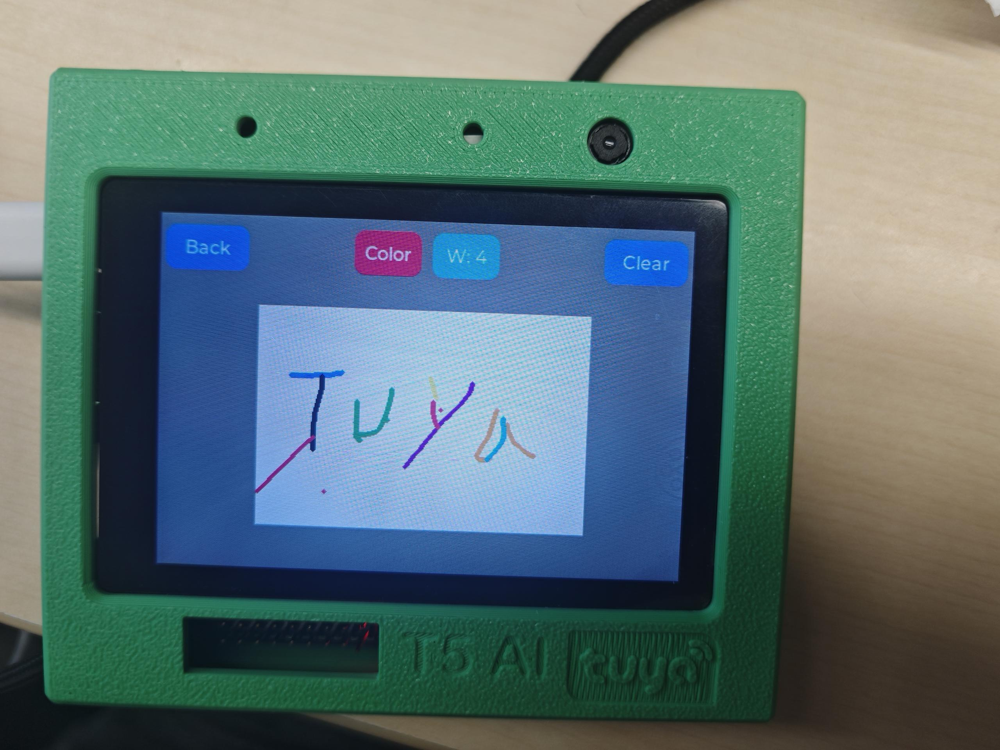
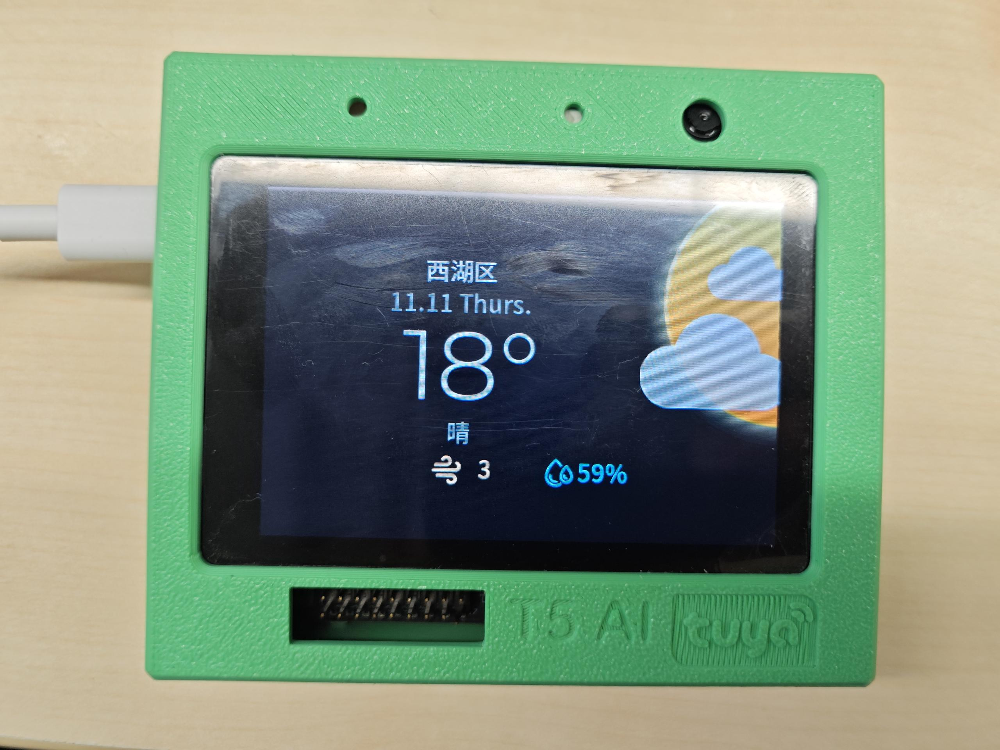

# GUI Application Development Guide

## Project Function Introduction

`your_chat_bot_multi_app` is a smart chatbot multi-application system based on the Tuya IoT platform, integrating a rich GUI interface and functional modules.



### Core Functions

1. **Smart Chatbot**
- AI voice conversation interaction
- Multiple conversation modes (button, wake word, etc.)
- Real-time chat content display

2. **Multi-Application Interface System**
- Home Page: Application entry, time display, WiFi status
- Settings Page: System settings, brightness, volume adjustment
- Weather Page: Real-time weather information display
- Calendar Page: Calendar view
- Game Applications:
- 2048 Game (Game2048Page)
- Memory Matching Game (GameMemoryPage)
- Dinosaur Jump Game (GameDinoPage)
- Wooden Fish Tapping (GameMuyuPage)
- Tool Applications:
- Calculator (CalculatorPage)
- Drawing Board (DrawPage)
- Camera Page: Camera function

3. **Page Management System**
- Stack-based page navigation
- Supports gesture swipe back
- Page lifecycle management (init/deinit)

4. **UI Framework**
- Based on LVGL v9 graphics library
- Supports touch interaction
- Rich UI components and animation effects

---

## How to Add Custom Pages

This guide will detail how to create new pages in the `gui_app/pages` directory. ### Step 1: Create Page Directory and Files

Create a new page directory in the `src/display/gui_app/pages/` directory, for example, `ui_MyPage`:

```bash
mkdir -p src/display/gui_app/pages/ui_MyPage
```

Create the following two files:

#### 1.1 Create Header File `ui_MyPage.h`

```c
#ifndef _UI_MYPAGE_H
#define _UI_MYPAGE_H

#ifdef __cplusplus
extern "C" {
#endif

#include "../../ui.h"

void ui_MyPage_init(void);
void ui_MyPage_deinit(void);

#ifdef __cplusplus
} /*extern "C"*/
#endif

#endif
```

#### 1.2 Create Source File `ui_MyPage.c`

```c
#include "ui_MyPage.h"
#include "tal_log.h"
#include "lvgl.h"

///////////////////// VARIABLES ////////////////////

lv_obj_t * ui_MyPage;

///////////////////// FUNCTIONS ////////////////////

// Gesture event handling: Supports left and right swipe to return to the previous page
static void ui_event_Gesture(lv_event_t * e)
{
lv_event_code_t code = lv_event_get_code(e);
if(code == LV_EVENT_GESTURE)
{
if(lv_indev_get_gesture_dir(lv_indev_get_act()) == LV_DIR_LEFT ||
lv_indev_get_gesture_dir(lv_indev_get_act()) == LV_DIR_RIGHT)
{
lv_lib_pm_OpenPrePage(&page_manager);
}
}
}

///////////////////// SCREEN init ////////////////////

void ui_MyPage_init(void)
{
// Create page object
ui_MyPage = lv_obj_create(NULL);
lv_obj_remove_flag(ui_MyPage, LV_OBJ_FLAG_SCROLLABLE);

// Set page background color
``` ```c
lv_obj_set_style_bg_color(ui_MyPage, lv_color_hex(0xFFFFFF), LV_PART_MAIN | LV_STATE_DEFAULT);
lv_obj_set_style_bg_opa(ui_MyPage, LV_OPA_COVER, LV_PART_MAIN | LV_STATE_DEFAULT);

// Create UI elements (example: create a label)
lv_obj_t *label = lv_label_create(ui_MyPage);
lv_label_set_text(label, "This is my custom page");
lv_obj_center(label);

// Add gesture event (optional, for returning to the previous page)
lv_obj_add_event_cb(ui_MyPage, ui_event_Gesture, LV_EVENT_GESTURE, NULL);

// Key: Load the page to the screen
lv_scr_load_anim(ui_MyPage, LV_SCR_LOAD_ANIM_MOVE_RIGHT, 100, 0, true);
}

/////////////////// SCREEN deinit ////////////////////

void ui_MyPage_deinit(void)
{
// Clean up resources (if there is dynamically allocated memory, free it here)
// For example: tal_free(...)
}
```

### Step 2: Register the new page in `ui.c`

Edit the `src/display/gui_app/ui.c` file:

#### 2.1 Add header file inclusion

Add the following at the top of the file:

```c
#include "./pages/ui_MyPage/ui_MyPage.h"
```

#### 2.2 Register the page in the `ui_apps` array

Find the `ui_apps` array definition and add the new page:

```c
ui_app_data_t ui_apps[] =
{
// ... other pages ...
{
.name = "MyPage",                    // Page name (for navigation)
.init = ui_MyPage_init,              // Initialization function
.deinit = ui_MyPage_deinit,          // Deinitialization function
.page_obj = NULL
},
};
```

**Note**: Ensure that the value of the `_APP_NUMS` macro matches the number of pages in the array. The actual number of elements in the `ui_apps` array should be consistent.

### Step 3: Add Source Files to CMakeLists.txt

Edit the `src/display/CMakeLists.txt` file and add the source file of the new page to the `PAGES_SRCS` list:

```cmake
set(PAGES_SRCS
# ... other pages ...
${APP_MODULE_PATH}/gui_app/pages/ui_MyPage/ui_MyPage.c
)
```

**Important Note**: If the page has additional source files (such as `app_MyPage.c`), they also need to be added to the list:

```cmake
set(PAGES_SRCS
# ... other pages ...
${APP_MODULE_PATH}/gui_app/pages/ui_MyPage/ui_MyPage.c
${APP_MODULE_PATH}/gui_app/pages/ui_MyPage/app_MyPage.c  # If there are additional source files
)
```

### Step 4: Add an Entry Button on the Homepage (Optional)

If you want to access the new page from the homepage, you need to edit `ui_HomePage.c`:

#### 4.1 Create a Button

Add the button creation code in the `ui_HomePage_init()` function:

```c
lv_obj_t * ui_MyPageBtn = lv_btn_create(ui_AppContainer);
// Set button style, position, etc.
lv_obj_align(ui_MyPageBtn, LV_ALIGN_CENTER, 0, 0);
lv_obj_set_size(ui_MyPageBtn, 80, 80);

// Add button label
lv_obj_t * btn_label = lv_label_create(ui_MyPageBtn);
lv_label_set_text(btn_label, "My Page");
lv_obj_center(btn_label);

// Add click event
lv_obj_add_event_cb(ui_MyPageBtn, ui_event_AppsBtn, LV_EVENT_CLICKED, "MyPage");
```

**Note**: `"MyPage"` must match the page name registered in `ui.c`. ## Page Development Best Practices

### 1. Page Structure Specifications

Each page should include the following sections:

```c
///////////////////// VARIABLES ////////////////////
// Global variable definitions

///////////////////// ANIMATIONS ////////////////////
// Animation-related code (optional)

///////////////////// FUNCTIONS ////////////////////
// Helper functions, event handlers

///////////////////// SCREEN init ////////////////////
// Page initialization function

/////////////////// SCREEN deinit ////////////////////
// Page deinitialization function
```

### 2. Required Functions

- **`ui_XXXPage_init(void)`**: Page initialization
- Create page object
- Create UI elements
- Bind event handlers
- **Must call** `lv_scr_load_anim()` to load the page

- **`ui_XXXPage_deinit(void)`**: Page deinitialization
- Release dynamically allocated memory
- Clean up resources

### 3. Gesture Back Functionality

It is recommended to add gesture back functionality to each page:

```c
static void ui_event_Gesture(lv_event_t * e)
{
lv_event_code_t code = lv_event_get_code(e);
if(code == LV_EVENT_GESTU
```
```c
static void ui_event_Gesture(lv_event_t * e)
{
lv_event_code_t code = lv_event_get_code(e);
if(code == LV_EVENT_GESTURE)
{
if(lv_indev_get_gesture_dir(lv_indev_get_act()) == LV_DIR_LEFT ||
lv_indev_get_gesture_dir(lv_indev_get_act()) == LV_DIR_RIGHT)
{
lv_lib_pm_OpenPrePage(&page_manager);
}
}
}

// Bind in the init function:
lv_obj_add_event_cb(ui_MyPage, ui_event_Gesture, LV_EVENT_GESTURE, NULL);
```

### 4. Memory Management

- Use static variables to store page object pointers.
- If using dynamic memory allocation (e.g., `tkl_system_psram_malloc`), it must be freed in `deinit`.
- Large buffers are recommended to use dynamic allocation to reduce static memory usage.

### 5. Font Usage

If you need to use custom fonts:

```c
// Declare the font at the top of the file
LV_FONT_DECLARE(font_puhui_18_2);

// Set the font after creating the label
lv_obj_set_style_text_font(label, &font_puhui_18_2, LV_PART_MAIN | LV_STATE_DEFAULT);
```

### 6. Page Navigation

Navigate from another page to a new page:

```c
// Use the page manager to open the specified page
lv_lib_pm_OpenPage(&page_manager, "MyPage");
```

Return to the previous page:

```c
// Use the page manager to return to the previous page
lv_lib_pm_OpenPrePage(&page_manager);
```

---

## Complete Example: Creating a Simple "About" Page

### File Structure

```
src/display/gui_app/pages/ui_AboutPage/
├── ui_AboutPage.h
└── ui_AboutPage.c
```

### ui_AboutPage.h

```c
#ifndef _UI_ABOUTPAGE_H
#define _UI_ABOUTPAGE_H

#ifdef __cplusplus
extern "C" {
#endif

#include "../../ui.h"

void ui_AboutPage_init(void);
void ui_AboutPage_deinit(void);

#ifdef __cplusplus
} /*extern "C"*/
#endif

#endif
```

### ui_AboutPage.c

```c
#include "ui_AboutPage.h"
#include "tal_log.h"
#include "lvgl.h"

LV_FONT_DECLARE(font_puhui_18_2);

/////////////////////// VARIABLES /////////////////////

lv_obj_t * ui_AboutPage;

/////////////////////// FUNCTIONS /////////////////////

static void ui_event_Gesture(lv_event_t * e)
{ 
lv_event_code_t code = lv_event_get_code(e); 
if(code == LV_EVENT_GESTURE) 
{ 
if(lv_indev_get_gesture_dir(lv_indev_get_act()) == LV_DIR_LEFT || 
lv_indev_get_gesture_dir(lv_indev_get_act()) == LV_DIR_RIGHT) 
{ 
lv_lib_pm_OpenPrePage(&page_manager); 
} 
}
}

////////////////////// SCREEN init /////////////////////

void ui_AboutPage_init(void)
{ 
ui_AboutPage = lv_obj_create(NULL); 
lv_obj_remove_flag(ui_AboutPage, LV_OBJ_FLAG_SCROLLABLE); 
lv_obj_set_style_bg_color(ui_AboutPage, lv_color_hex(0xF0F0F0), LV_PART_MAIN | LV_STATE_DEFAULT); 
lv_obj_set_style_bg_opa(ui_AboutPage, LV_OPA_COVER, LV_PART_MAIN | LV_STATE_DEFAULT); 

//Create title 
lv_obj_t * title = lv_label_create(ui_AboutPage); 
lv_label_set_text(title, "About"); ```c
lv_obj_set_style_text_font(title, &font_puhui_18_2, LV_PART_MAIN | LV_STATE_DEFAULT);
lv_obj_align(title, LV_ALIGN_TOP_MID, 0, 20);

// Create content
lv_obj_t * content = lv_label_create(ui_AboutPage);
lv_label_set_text(content, "Tuya IoT Smart Device\nVersion: 1.0.0\nBased on LVGL v9");
lv_obj_set_style_text_font(content, &font_puhui_18_2, LV_PART_MAIN | LV_STATE_DEFAULT);
lv_obj_align(content, LV_ALIGN_CENTER, 0, 0);

// Add gesture event
lv_obj_add_event_cb(ui_AboutPage, ui_event_Gesture, LV_EVENT_GESTURE, NULL);

// Load page
lv_scr_load_anim(ui_AboutPage, LV_SCR_LOAD_ANIM_MOVE_RIGHT, 100, 0, true);
}

/////////////////// SCREEN deinit ////////////////////

void ui_AboutPage_deinit(void)
{
// No special cleanup needed
}
```

### Register in ui.c

```c
#include "./pages/ui_AboutPage/ui_AboutPage.h"

// ...

ui_app_data_t ui_apps[] =
{
// ... other pages ...
{
.name = "AboutPage",
.init = ui_AboutPage_init,
.deinit = ui_AboutPage_deinit,
.page_obj = NULL
},
};
```

### Add to CMakeLists.txt

```cmake
set(PAGES_SRCS
# ... other pages ...
${APP_MODULE_PATH}/gui_app/pages/ui_AboutPage/ui_AboutPage.c
)
```

---

## Frequently Asked Questions

### Q1: What to do if the page doesn't display? **A:** Ensure that `lv_scr_load_anim()` is called in the `init` function:

```c
lv_scr_load_anim(ui_MyPage, LV_SCR_LOAD_ANIM_MOVE_RIGHT, 100, 0, true);
```

### Q2: Compilation error "undefined reference to xxx"

**A:** Check the following:
1. Whether the source file is added to `PAGES_SRCS` in `CMakeLists.txt`
2. Whether the function declaration and definition match
3. Whether the header file is correctly included

### Q3: How to navigate from other pages to a new page?

**A:** Use the page manager:

```c
lv_lib_pm_OpenPage(&page_manager, "MyPage");
```

### Q4: How to add a button click event?

**A:**

```c
static void ui_event_btn_clicked(lv_event_t * e)
{
lv_event_code_t code = lv_event_get_code(e);
if(code == LV_EVENT_CLICKED)
{
// Handle click event
PR_DEBUG("Button clicked!");
}
}

// Bind the event after creating the button
lv_obj_add_event_cb(btn, ui_event_btn_clicked, LV_EVENT_CLICKED, NULL);
```

### Q5: How to use system parameters?

**A:** System parameters are stored in the global variable `ui_system_para`:

```c
// Read brightness
uint16_t brightness = ui_system_para.brightness;

// Read volume
uint16_t sound = ui_system_para.sound;

// Read location information
char *city = ui_system_para.location.city;
```

### Q6: How to get weather information? **A:** Using the weather service API (the `get_weather_info` function needs to be implemented first):

```c
#include "app_WeatherPage.h"

WeatherInfo_t weather_info;
if(get_weather_info(&weather_info) == 0)
{
// Use weather information
PR_DEBUG("Weather: %s, Temp: %s°C",
weather_info.weather,
weather_info.temperature);
}
```

---

## Reference Resources

- **LVGL Official Documentation**: https://docs.lvgl.io/
- **Tuya IoT Development Documentation**: https://developer.tuya.com/
- **Existing Page Examples**:
- Simple Page: `ui_CameraPage`
- Complex Page: `ui_HomePage`
- Game Page: `ui_Game2048Page`
- Tool Page: `ui_CalculatorPage`
- Template Page: `ui_template`

---

## Notes

1. **Naming Convention**: Page directories and files should use the `ui_XXXPage` format.
2. **Memory Optimization**: Use dynamic allocation (`tkl_system_psram_malloc`) for large buffers.
3. **Error Handling**: Add necessary null pointer checks and error handling.
4. **Code Style**: Follow the existing code style for consistency.
5. **Testing**: After adding a new page, be sure to test compilation and execution.

---

**Happy coding!** 🚀