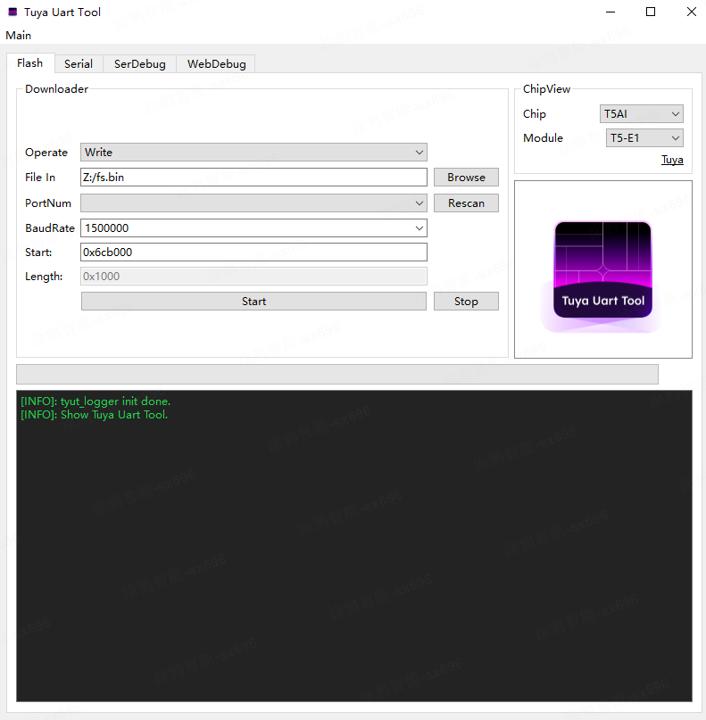
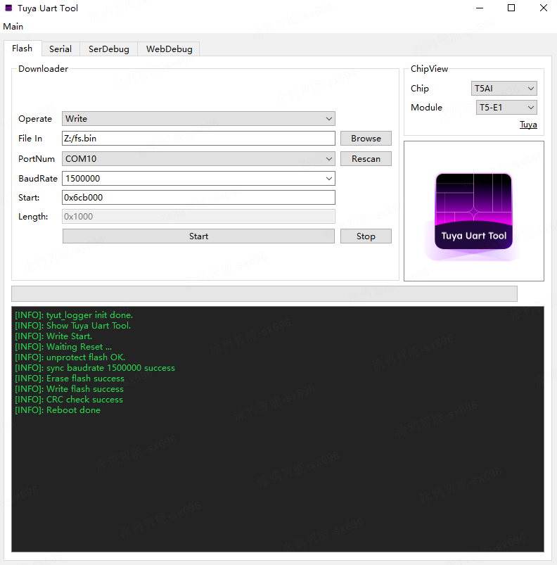
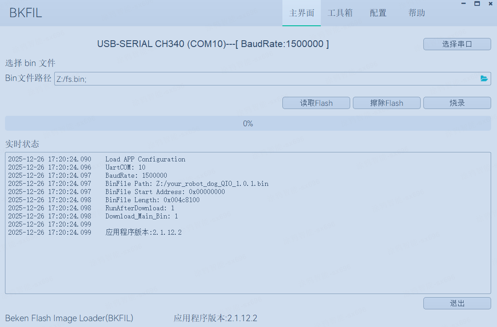
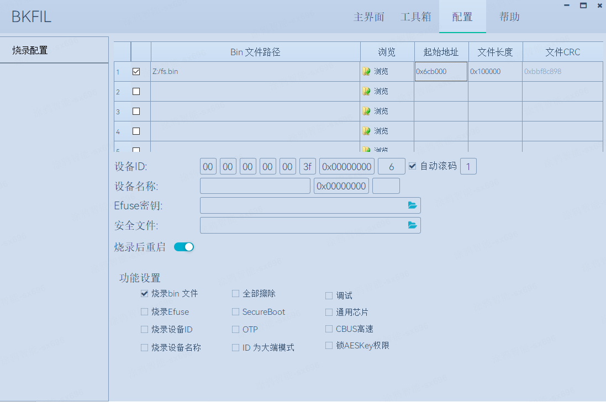

English | [简体中文](./RAEDME_zh.md)

# your_robot_dog
<<<<<<< HEAD
[your_robot_dog](https://github.com/tuya/TuyaOpen/tree/master/apps/tuya.ai/your_robot_dog) is ported from the TuyaOS `tuyaos_demo_ai_toy` project to TuyaOpen based on `your_char_bot`. It adds vivid robot-dog expression changes and servo-controlled actions, bringing an open-source LLM-powered smart-chat robot dog to TuyaOpen. Audio is captured through a microphone and transcribed by ASR to enable conversation, interaction, and playful banter. Emotion changes and interactive behaviors are also shown on the screen.
=======
[your_robot_dog](https://github.com/tuya/TuyaOpen/tree/master/apps/tuya.ai/your_robot_dog) is ported from the TuyaOS `tuyaos_demo_ai_toy` project based on TuyaOpen’s `your_char_bot`. It adds vivid robot-dog facial expression changes and servo-controlled actions, bringing an open-source LLM-powered smart-chat robot dog to TuyaOpen. It captures voice through a microphone, performs speech recognition, and enables conversation, interaction, and teasing. You can also see emotion changes on the screen and observe interactive behaviors.
>>>>>>> a1855ca1e57928f4b93f6508bad5f6fba428294c

## Supported Features
1. AI smart conversation
2. Key wake / voice wake; turn-based dialog; supports voice interruption (hardware-dependent)
3. Expression display
<<<<<<< HEAD
4. Supports LCD to display chat content in real time; supports viewing chat content in real time from the app
=======
4. Supports LCD to show chat content in real time; supports viewing chat content in real time on the app
>>>>>>> a1855ca1e57928f4b93f6508bad5f6fba428294c
5. Switch AI agent roles in real time from the app
6. Voice control for robot-dog behaviors

## Required Hardware Capabilities
1. Audio capture
2. Audio playback
3. Servo drive

## Supported Hardware
| Model | config |
| --- | --- |
| TUYA_T5AI_ROBOT_DOG | TUYA_T5AI_ROBOT_DOG.config |

## Flashing / Programming
Prepare a CH340 USB-to-serial adapter. Connections:
TX  -------------- RX0
RX  -------------- TX0
RST -------------- RST

To view serial logs:
TX  -------------- RX_L
RX  -------------- TX_L
GND -------------- GND
<<<<<<< HEAD
Make sure they share a common ground; otherwise logs may appear garbled.
=======
Make sure they share a common ground, otherwise logs may appear garbled.
>>>>>>> a1855ca1e57928f4b93f6508bad5f6fba428294c

## Build
1. Run `tos.py config choice` and select `TUYA_T5AI_ROBOT_DOG.config`.
2. If you need to modify the configuration, run `tos.py config menu` first.
3. Run `tos.py build` to build the project.

## Configuration Guide

### Default Configuration
- Free-chat mode; AEC is disabled; interruption is not supported.
- Wake word:
	- T5AI version: 你好涂鸦

### Common Configuration

- **Select chat mode**

	- Press-and-hold mode

		| Macro | Type | Description |
		| --- | --- | --- |
		| ENABLE_CHAT_MODE_KEY_PRESS_HOLD_SINGEL | Boolean | Hold the key while speaking; release after finishing one sentence. |

	- Key-triggered mode

		| Macro | Type | Description |
		| --- | --- | --- |
		| ENABLE_CHAT_MODE_KEY_TRIG_VAD_FREE | Boolean | Press once to enter/exit listening. In listening state, VAD detection is enabled and you can talk. |

	- Wake-word mode

		| Macro | Type | Description |
		| --- | --- | --- |
		| ENABLE_CHAT_MODE_ASR_WAKEUP_SINGEL | Boolean | You must say the wake word to wake the device. After waking, it enters listening and you can have one turn of dialog. To continue, wake it again with the wake word. |

	- Free chat (wake-word + continuous)

		| Macro | Type | Description |
		| --- | --- | --- |
		| ENABLE_CHAT_MODE_ASR_WAKEUP_FREE | Boolean | You must say the wake word to wake the device. After waking, it enters listening and you can chat freely. If no sound is detected for 30s, you must wake it again. |

- **Wake word**

<<<<<<< HEAD
	This option appears only when the chat mode is **Wake-word mode** or **Free chat**.
=======
	This option only appears when the chat mode is **Wake-word mode** or **Free chat**.
>>>>>>> a1855ca1e57928f4b93f6508bad5f6fba428294c

	| Macro | Type | Description |
	| --- | --- | --- |
	| ENABLE_WAKEUP_KEYWORD_NIHAO_TUYA | Boolean | Wake word is “你好涂鸦”. |

- **AEC support**

	| Macro | Type | Description |
	| --- | --- | --- |
	| ENABLE_AEC | Boolean | Configure based on whether the board hardware supports echo cancellation. If the board supports AEC, enable it. **If the board does not support AEC, disable this option; otherwise it will affect wake-word dialog**. If disabled, voice interruption is not supported. |

- **Speaker enable pin**

	| Macro | Type | Description |
	| --- | --- | --- |
	| SPEAKER_EN_PIN | Number | Controls whether the speaker is enabled. Range: 0–64. |

- **Chat button pin**

	| Macro | Type | Description |
	| --- | --- | --- |
	| CHAT_BUTTON_PIN | Number | Button pin used to control dialog. Range: 0–64. |

- **Enable modules**

	| Option | Description |
	| --- | --- |
	| enable the display module | Enable display features. Turn this on if the board has a screen. |
	| enable the dog action | Enable dog actions. |

### Display Configuration

The following options appear only after display is enabled.

- **Select UI style**

	| Option | Type | Description |
	| --- | --- | --- |
	| Use Robot Dog ui | Boolean | Default. Shows the top status bar and the dog expressions. |

### File System Configuration

Required: some robot-dog expression GIFs have been packed into a LittleFS image at `./src/display/emotion/fs/fs.bin`. You must flash it to the specified address in FLASH.

<<<<<<< HEAD
If you do not configure this, it may cause abnormal reboots or incomplete dog-expression rendering.

Steps:
1. Download TuyaOpen’s official flashing tool TyuTool. TyuTool is a cross-platform serial tool designed for IoT developers, used to flash and read firmware on various mainstream chips.
2. Open TyuTool, select “Write” in “Operate”, and select the `fs.bin` path in “File In”.
3. In “Start”, configure the start address for `fs.bin` to `0x6cb000`, then click the “Start” button at the bottom to begin flashing.

4. If it looks like the figure below, flashing is successful.

#### How to generate fs.bin yourself (optional)

If you want to add/remove expressions, you can re-pack locally:

1. Prepare GIFs  
   Rename your expression files to:
   `angry.gif confused.gif disappointed.gif embarrassed.gif happy.gif laughing.gif relaxed.gif sad.gif happy.gif surprise.gif thinking.gif `
   and place them all in an empty directory, for example `/tmp/gif_pack`.
   Notes: the total size of all GIFs must be < 1 MB. The device code loads them via absolute paths like `/angry.gif`, so the filenames must match what the code expects.

2. One-command packing  
   Use the `mklittlefs` tool. Usage instructions are at `TuyaOpen/platform/T5AI/t5_os/ap/components/littlefs/mkimg/README.md`.
   From the TuyaOpen repository root, run:

   platform/T5AI/t5_os/ap/components/littlefs/mkimg/mklittlefs \
     -c /tmp/gif_pack \
     -b 4096 -p 256 -s 1048576 \
     apps/tuya.ai/your_robot_dog/fs.bin

	After the command completes, you will see the generated `fs.bin` under `apps/tuya.ai/your_robot_dog`.

	Parameter meaning:
	-c source directory  -b block size  -p page size  -s total image size (1 MB)
=======
If not configured, the system may access an invalid address (symptom: reboot loop) or the dog expressions may be incomplete.

Steps:
1. Download BKFIL (Beken FLASH Image Loader), Armino’s official flashing/configuration tool.
2. In BKFIL, select the flashing serial port in “选择串口”, and choose the `fs.bin` path in “Bin文件路径”.

3. Open the “配置” page. In the `fs.bin` row, set start address to `0x6cb000` and file length to `0x100000`.

4. Go back to the main page and click flash/program.
>>>>>>> a1855ca1e57928f4b93f6508bad5f6fba428294c

## Additional Notes
`your_robot_dog` is a ported project. The baseboard for `TUYA_T5AI_ROBOT_DOG` differs significantly from a standard T5AI dev board.

<<<<<<< HEAD
Audio playback and camera functions are not yet supported.
=======
 Audio playback and camera functions are not yet supported.
>>>>>>> a1855ca1e57928f4b93f6508bad5f6fba428294c

