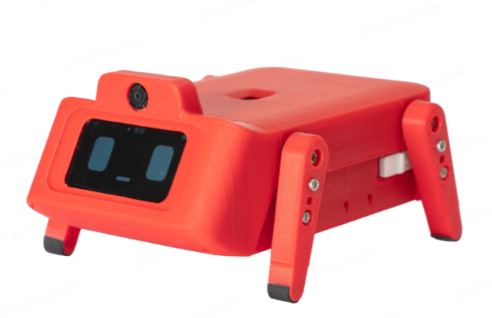

[English](./README.md) | [简体中文](./RAEDME_zh.md)

# your_robot_dog
 is ported from the TuyaOS `tuyaos_demo_ai_toy` project based on TuyaOpen `your_char_bot`. It adds vivid robot-dog facial expressions and servo-driven actions, bringing an open-source LLM-powered smart chat robot dog to this platform. Audio is captured through a microphone and recognized via ASR to enable conversations, interactions, and teasing. Emotional changes and interactive behaviors are also shown on the screen.

## Supported Features
1. AI smart conversation
2. Button wake-up / voice wake-up, turn-based conversation, supports voice interruption (hardware required)
3. Expression display
4. Supports LCD to show real-time chat content; supports viewing chat content in real time in the App
5. Switch AI agent roles in real time from the App
6. Voice control for robot-dog behaviors

## Required Hardware Capabilities
1. Audio capture
2. Audio playback
2. Servo drive

## Supported Hardware
| Model | config |
| --- | --- |
| TUYA_T5AI_ROBOT_DOG | TUYA_T5AI_ROBOT_DOG.config |

## Firmware Flashing
Prepare a CH340 and wire as below:

CH340            TUYA_T5AI_ROBOT_DOG
TX  -------------- RX0
RX  -------------- TX0
RST -------------- RST

To view UART logs:
CH340            TUYA_T5AI_ROBOT_DOG
TX  -------------- RX_L
RX  -------------- TX_L
GND -------------- GND
GND must be connected (common ground), otherwise logs may appear garbled.

## Build
1. Run `tos.py config choice` and select `TUYA_T5AI_ROBOT_DOG.config`.
2. If you need to change configuration, run `tos.py config menu` first.
3. Run `tos.py build` to build the project.

## Configuration

### Default Configuration
- Free-chat mode, AEC disabled, interruption not supported
- Wake word:
	- T5AI version: Hello Tuya

### Common Configuration

- **Select conversation mode**

	- Press-and-hold talk mode

		| Macro | Type | Description |
		| --- | --- | --- |
		| ENABLE_CHAT_MODE_KEY_PRESS_HOLD_SINGEL | Bool | Hold the button while speaking, and release the button after finishing one sentence. |

	- Button talk mode

		| Macro | Type | Description |
		| --- | --- | --- |
		| ENABLE_CHAT_MODE_KEY_TRIG_VAD_FREE | Bool | Press the button once to enter/exit listening state. In listening state, VAD detection is enabled, and you can talk. |

	- Wake-word talk mode

		| Macro | Type | Description |
		| --- | --- | --- |
		| ENABLE_CHAT_MODE_ASR_WAKEUP_SINGEL | Bool | You must say the wake word to wake up the device. After wake-up, the device enters listening state and you can talk. Each wake-up supports only one round of conversation. To continue, wake up again with the wake word. |

	- Free talk mode

		| Macro | Type | Description |
		| --- | --- | --- |
		| ENABLE_CHAT_MODE_ASR_WAKEUP_FREE | Bool | You must say the wake word to wake up the device. After wake-up, the device enters listening state for free conversation. If no sound is detected for 30 seconds, you need to wake up again. |

- **Wake word**
	This option appears only when the conversation mode is **Wake-word talk** or **Free talk**.

	| Macro | Type | Description |
	| --- | --- | --- |
	| ENABLE_WAKEUP_KEYWORD_NIHAO_TUYA | Bool | Wake word is "你好涂鸦" |

- **AEC support**

	| Macro | Type | Description |
	| --- | --- | --- |
	| ENABLE_AEC | Bool | Configure this based on whether the board hardware supports acoustic echo cancellation (AEC). If AEC is supported, enable this option. **If the board does not support AEC, you must disable it; otherwise it will affect wake-word conversation.** If disabled, voice interruption is not supported. |

- **Speaker enable pin**

	| Macro | Type | Description |
	| --- | --- | --- |
	| SPEAKER_EN_PIN | Number | Controls whether the speaker is enabled. Range: 0-64. |

- **Conversation button pin**

	| Macro | Type | Description |
	| --- | --- | --- |
	| CHAT_BUTTON_PIN | Number | GPIO pin for the conversation button. Range: 0-64. |

- **Enable display**

	| Option | Description |
	| --- | --- |
	| enable the display module | Enable display features. If the board has a screen, you can turn this on. |
	| enable the dog action | Enable robot-dog actions. |

### Display Configuration

The following options appear only after enabling display.

- **Select display UI style**

	| Option | Type | Description |
	| --- | --- | --- |
	| Use Robot Dog ui | Bool | Default configuration: shows the top status bar and robot-dog expressions. |

## Notes
your_robot_dog is a ported project. The baseboard of TUYA_T5AI_ROBOT_DOG differs significantly from a typical T5AI development board.
Music playback and camera features are not supported yet.
