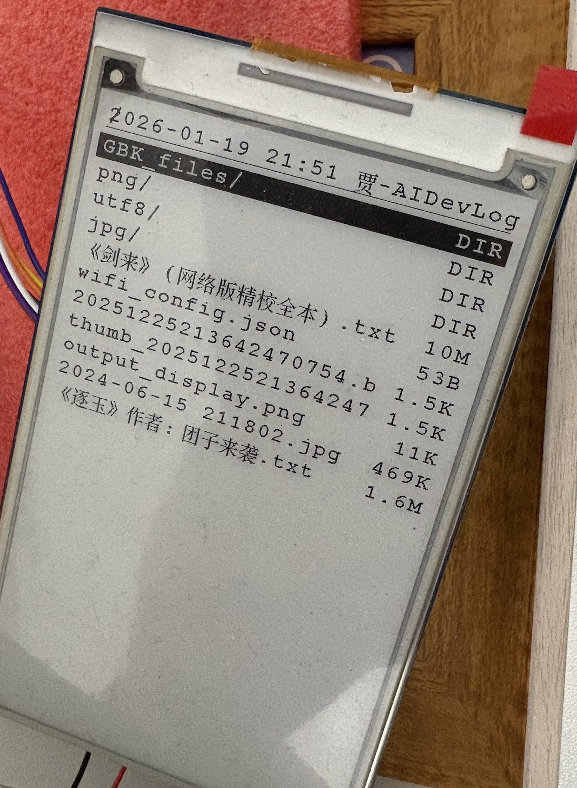
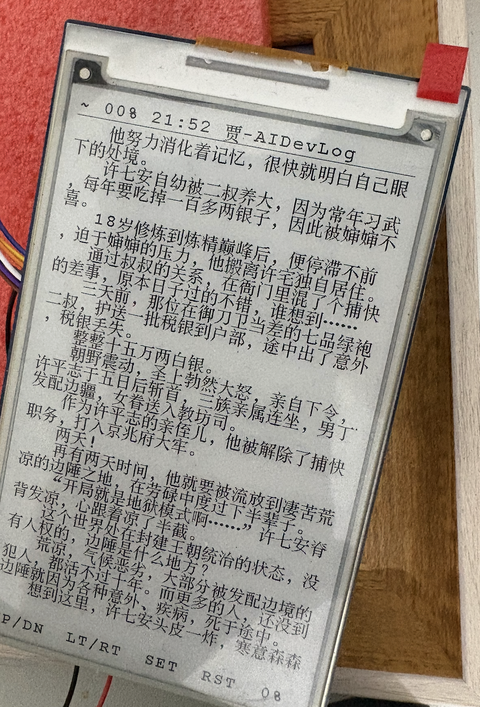
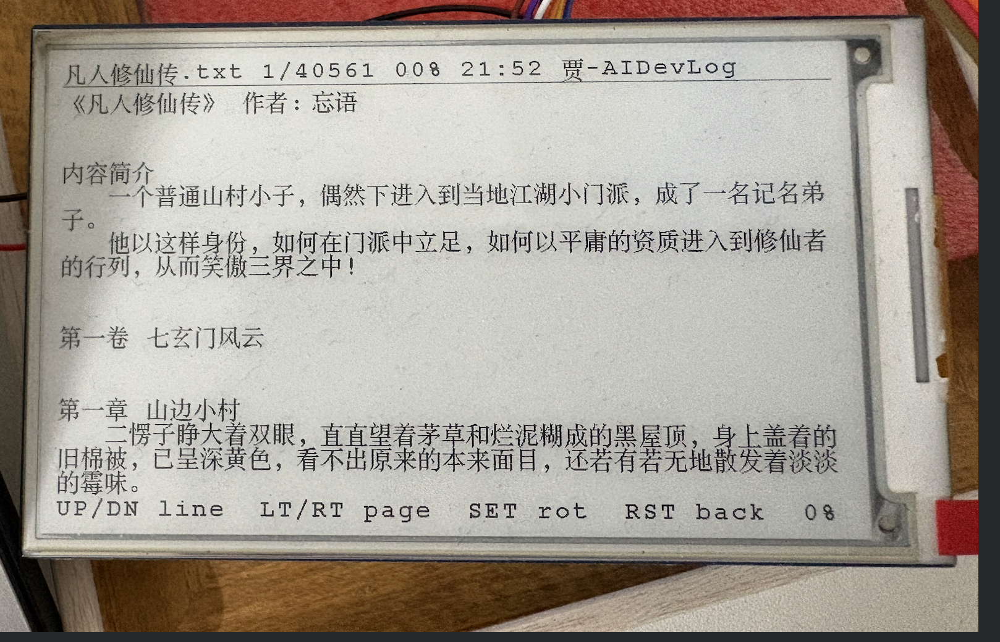
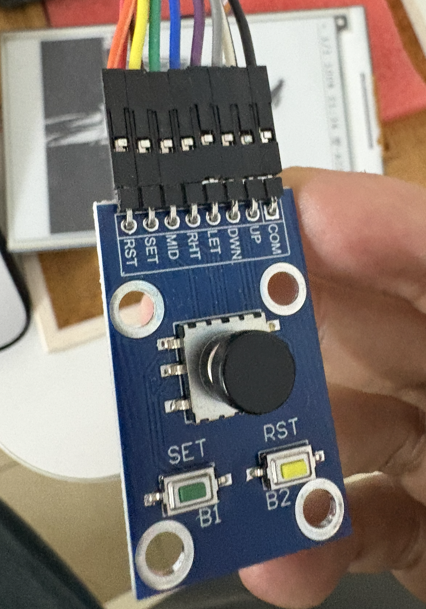
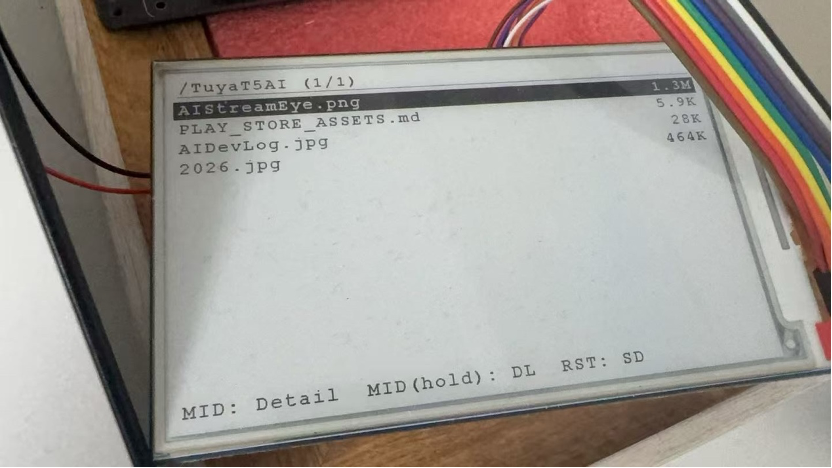
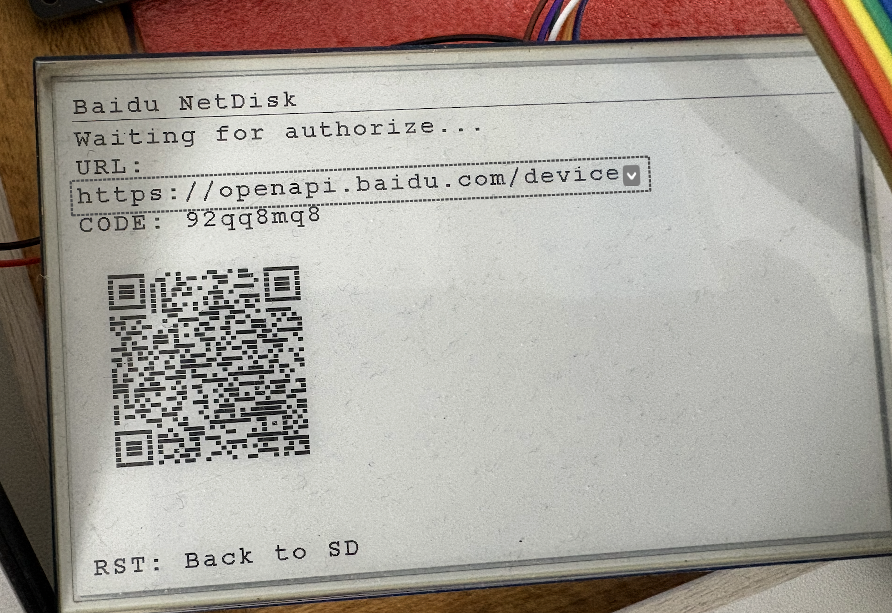
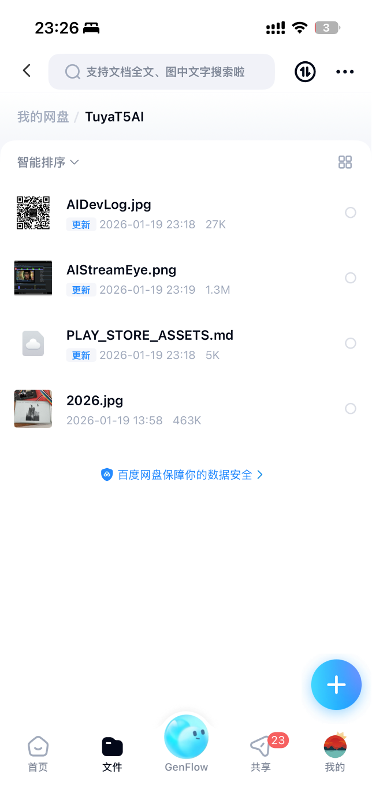
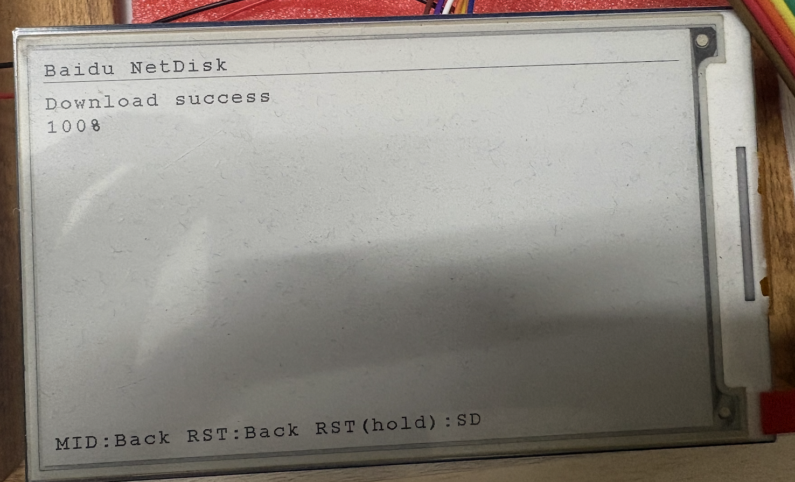
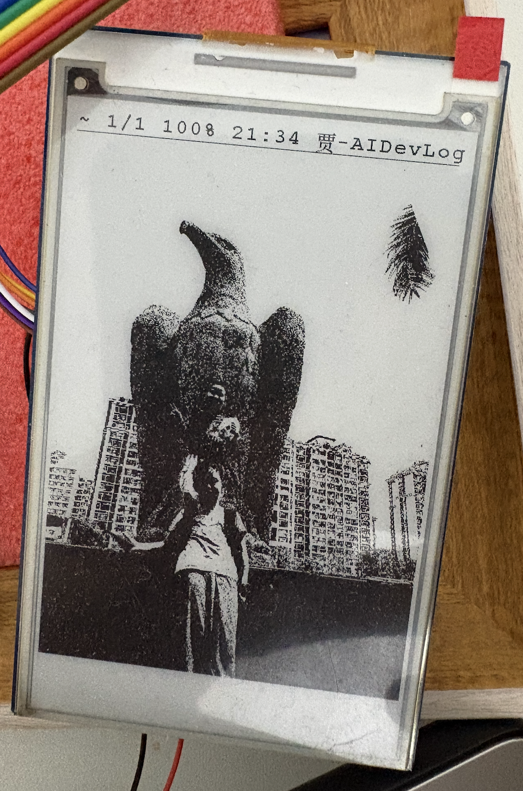

# 墨阅 · E-Paper Reader (epaper_reader)

中文 | English

---

**中文简介**

墨阅（E-Paper Reader）是基于 Tuya T5 平台的轻量级墨水屏文件阅读演示工程。它支持 SD 卡目录浏览、文本分页阅读（断点记录）、图片渲染（1-bit 黑白）、按键交互与启动网络时间同步，便于在无网络环境下离线阅读与展示静态内容。

主要功能：
- SD 卡目录分页浏览
- 文本文件自动换行与分页（保存阅读断点）
- 图片（BMP/JPG/PNG）渲染为 1-bit 黑白图
- 横竖屏旋转与按键控制（UP/DOWN/LEFT/RIGHT/MID/SET/RST）
- 启动时尝试通过 HTTP Date 同步时间

示例目录结构（本工程）：
- `src/`：应用源码（文本阅读、图片解码、UI 绘制）
- `lib/`：EPD 驱动、字库与 GUI 绘制工具
- `screenshots/`：示例截图（占位，可替换）

视频：

- [贾-墨阅 · 墨水屏文本图片阅读器](https://www.bilibili.com/video/BV1pjkgB6EiT)
- [涂鸦 4.26 贾-墨阅 · 墨水屏文本图片阅读器_百度网盘下载文本图片到 SD 卡查看](https://www.bilibili.com/video/BV1hhz7BYEAa)

截图示例：

- 列表与 SD 卡文件： 
- 文本（竖屏）： 
- 文本（横屏）： 
- 7 键布局： 
- 百度网盘文件列表： 
- 百度网盘二维码： 
- 百度网盘 App 界面： 
- 百度网盘下载成功： 
- 兼容图片示例： 

(更多示例图见 `screenshots/` 目录)

快速上手

1. 将工程放入 TuyaOpen 工作区：
   - 路径：`apps/tuya_t5_epaper_reader`（工程内部标识为 `epaper_reader`）
2. 准备 4.26" 墨水屏硬件并插入 SD 卡（FAT32），SD 卡放入若干文本或图片文件。
3. 构建并烧录固件（示例命令依平台而定，例如 Tuya 工具链或 CMake/Ninja）。
4. 上电后，设备将挂载 `/sdcard` 并显示文件列表，使用按键进行浏览与阅读。

开发者说明

- 字库：使用 `lib/Fonts/hzk24` 进行中文 GBK 渲染；程序会尽量检测文件编码（UTF-8 / UTF-16 / GBK）并做相应处理。
- 图片：通过内置 PNG/JPEG/BMP 解码器渲染为 1-bit 位图以适配 EPD。
- 断点记录：保存在 SD 卡隐藏目录 `/.sd_reader/progress.bin`。

百度网盘开发平台集成

- 功能：内置对百度网盘的浏览与下载支持。设备可通过二维码/设备码完成授权后，浏览配置目录（默认 `BDNDK_TARGET_DIR` 为 `/TuyaT5AI`）并将文件下载到 SD 卡。
- 启动：长按 `RST` 键进入 Baidu NetDisk 模式并启动授权流程，界面会显示二维码或授权 URL 与设备码供用户在手机上授权。
- 操作：在网盘列表中使用方向键选择文件，按 `MID` 查看详情；在详情界面按 `MID` 开始下载。
- 存储：下载文件保存到 SD 卡目录 `/sdcard/TuyaT5AI`（可在运行时通过 `bdndk_storage_set` 指定）。
- 进度与错误：下载进度会在网盘消息页显示，失败时提供错误详情与最近的下载 URL 以便调试。
- Token/缓存：OAuth token 与会话信息保存在 SD 卡 `/.sd_reader/baidu_token.txt`，下次可自动恢复会话。

贡献与许可

欢迎提交 PR、Issue 或直接在本工程基础上二次开发。请遵循仓库 LICENSE 与贡献规范。

---

**English Summary**

E-Paper Reader (epaper_reader) is a lightweight demonstration app for Tuya T5 platforms that showcases offline file browsing and reading on a 4.26" e-paper display. It supports SD card directory listing, paginated text reading with resume support, 1-bit image rendering, button navigation, and optional HTTP Date time sync at startup.

Key features:
- SD card browsing with pagination
- Text auto-wrap, pagination, and resume (progress saved)
- Image rendering (BMP/JPG/PNG) converted to 1-bit for EPD
- Rotation support and button controls (UP/DOWN/LEFT/RIGHT/MID/SET/RST)
- Startup HTTP Date time synchronization

Project layout:
- `src/`: application source (text reader, image decoding, UI)
- `lib/`: EPD driver, fonts and GUI helpers
- `screenshots/`: example screenshots (placeholders — replace with real images)

Quick start:
1. Place the project under the TuyaOpen workspace: `apps/tuya_t5_epaper_reader` (internal id: `epaper_reader`).
2. Prepare a 4.26" e-paper device and SD card (FAT32) with text/image files.
3. Build and flash using your usual toolchain (CMake/Ninja or Tuya build tools).
4. After boot, the app mounts `/sdcard` and shows the file list; navigate with buttons.

Developer notes:
- Fonts: `lib/Fonts/hzk24` (GBK) used for Chinese rendering; encoding detection attempts to handle UTF-8/UTF-16/GBK.
- Images: decoded and dithered to 1-bit for EPD.
- Progress file: `/.sd_reader/progress.bin` on the SD card.

Baidu NetDisk Integration

- Features: built-in browsing and downloading from Baidu Net Disk. The device can be authorized via QR/device-code, then browse the configured `BDNDK_TARGET_DIR` (default `/TuyaT5AI`) and download files to the SD card.
- Start: long-press `RST` to enter Baidu Net Disk mode and start the device auth flow; the UI shows a QR code and/or verification URL and user code for mobile authorization.
- Controls: navigate the list with arrow keys, press `MID` to view file details; press `MID` in the detail view to begin download.
- Storage: downloaded files are saved under `/sdcard/TuyaT5AI` (adjustable via `bdndk_storage_set`).
- Progress & errors: download progress is shown in the NetDisk message screen; errors and the last-download URL are exposed for debugging.
- Token/cache: OAuth tokens and session info are stored in `/.sd_reader/baidu_token.txt` on the SD card for session restore.

Screenshots

Please replace the placeholder SVGs in `screenshots/` with real PNG/JPG screenshots for README rendering and releases.

Contact & Contribution

Submit issues or pull requests to the upstream repository; follow the repository license and contribution guidelines.
