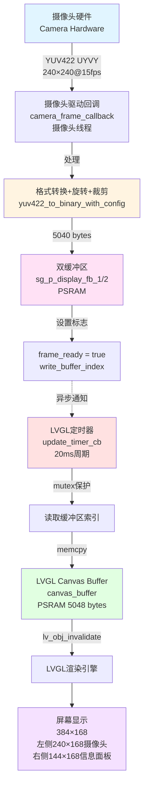
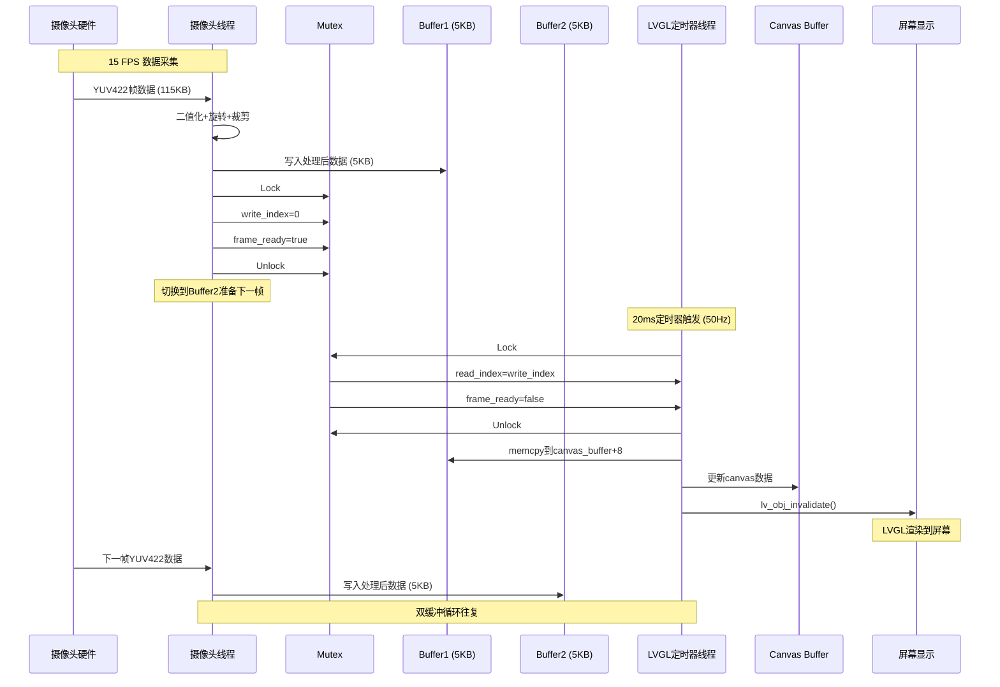
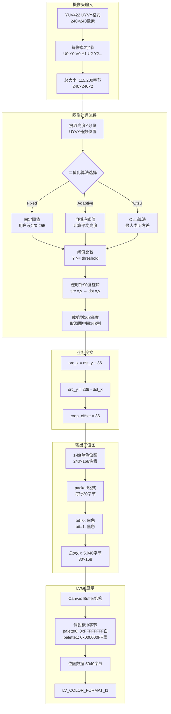
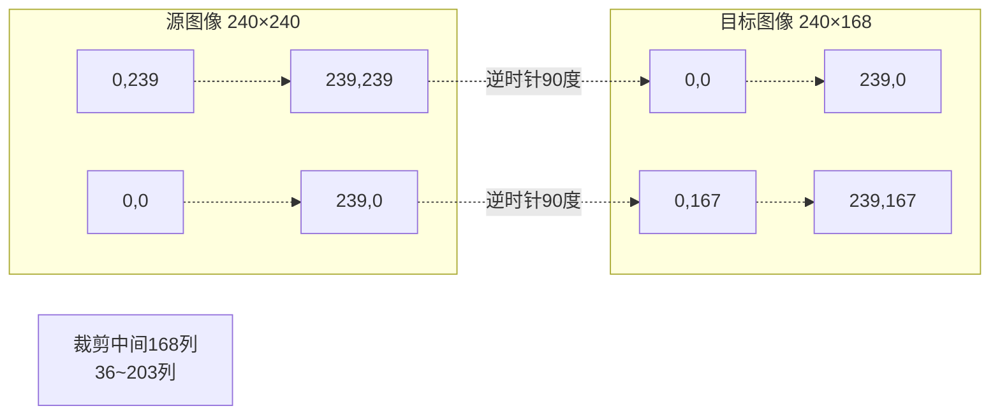
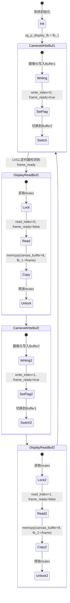
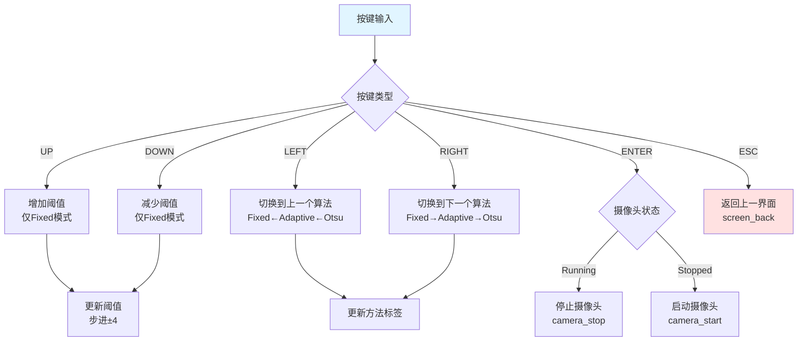

# Camera Screen 架构文档

## 概述

本文档详细描述了 `camera_screen.c` 的实现架构，包括摄像头数据采集、图像处理、格式转换和LVGL显示的完整流程。

## 系统架构

### 整体数据流



### 线程模型



## 数据格式转换

### 详细转换流程



### 旋转变换详解



**变换公式:**
```
对于目标像素 (dst_x, dst_y):
  src_x = dst_y + crop_offset  // crop_offset = 36
  src_y = 239 - dst_x
```

## 核心模块

### 1. 二值化算法模块

#### 固定阈值法 (Fixed Threshold)
```c
threshold = config->fixed_threshold;  // 用户设定 0-255
if (luminance >= threshold) {
    // 白色像素: bit = 0
} else {
    // 黑色像素: bit = 1
}
```

#### 自适应阈值法 (Adaptive)
```c
threshold = Σ(所有像素亮度) / 总像素数
```
- 适用场景: 光照均匀的环境
- 计算复杂度: O(n)
- 优点: 简单快速，适应整体亮度变化

#### Otsu算法 (Otsu's Method)
```c
最大化类间方差:
σ²(t) = w₀(t) × w₁(t) × [μ₀(t) - μ₁(t)]²
```
- 适用场景: 前景背景分离明显
- 计算复杂度: O(256n) ≈ O(n)
- 优点: 自动确定最优阈值

### 2. 双缓冲同步机制



### 3. LVGL Canvas集成

#### Canvas Buffer结构
```
+-------------------+
| 调色板 (8 bytes)  |  ← 偏移 0
| [0]: 0xFFFFFFFF   |     palette[0] = 白色
| [1]: 0x000000FF   |     palette[1] = 黑色
+-------------------+
| 位图数据          |  ← 偏移 8
| (5040 bytes)      |     240×168 ÷ 8
| Row 0: 30 bytes   |
| Row 1: 30 bytes   |
| ...               |
| Row 167: 30 bytes |
+-------------------+
总大小: 5048 bytes
```

#### 位图数据排列
```
每个字节表示8个像素 (MSB first):
Byte[0]: [bit7][bit6][bit5][bit4][bit3][bit2][bit1][bit0]
         pixel0 pixel1 pixel2 ... pixel7

bit=0 → palette[0] → 白色
bit=1 → palette[1] → 黑色
```

## 内存布局

### 全局静态变量

| 变量名 | 类型 | 大小 | 位置 | 说明 |
|--------|------|------|------|------|
| `sg_p_display_fb_1` | `TDL_DISP_FRAME_BUFF_T*` | 5040B | PSRAM | 缓冲区1 |
| `sg_p_display_fb_2` | `TDL_DISP_FRAME_BUFF_T*` | 5040B | PSRAM | 缓冲区2 |
| `canvas_buffer` | `uint8_t*` | 5048B | PSRAM | Canvas显示缓冲 |
| `sg_buffer_mutex` | `MUTEX_HANDLE` | - | - | 缓冲区互斥锁 |
| `frame_ready` | `volatile bool` | 1B | - | 新帧就绪标志 |
| `write_buffer_index` | `volatile uint8_t` | 1B | - | 写缓冲索引0/1 |
| `read_buffer_index` | `volatile uint8_t` | 1B | - | 读缓冲索引0/1 |

**总内存占用:** ~15KB (PSRAM)

## 性能指标

### 吞吐量分析

| 阶段 | 输入大小 | 输出大小 | 处理时间 | 频率 |
|------|----------|----------|----------|------|
| 摄像头采集 | - | 115,200B | ~67ms | 15 FPS |
| YUV→二值化 | 115,200B | 5,040B | <67ms | 15 FPS |
| memcpy复制 | 5,040B | 5,040B | <1ms | 50 Hz |
| LVGL渲染 | 5,040B | - | ~20ms | 50 Hz |

### 数据压缩比
```
压缩比 = 115,200 ÷ 5,040 ≈ 22.86:1
存储节省 = (1 - 5040/115200) × 100% ≈ 95.6%
```

### CPU负载估算
- **摄像头线程:** 15次/秒 × ~50ms = 75% (理论峰值)
- **LVGL定时器:** 50次/秒 × ~1ms = 5%
- **总估算:** ~80% (实际会更低，因为有等待时间)

## 用户交互

### 按键控制



### 信息面板显示

```
┌────────────────────────┐
│ Method:                │
│ Adaptive               │ ← 当前算法
├────────────────────────┤
│ Threshold:             │
│ 127                    │ ← 当前/计算的阈值
├────────────────────────┤
│ Status:                │
│ Running                │ ← 摄像头状态
└────────────────────────┘
```

## 屏幕布局

```
┌─────────────────────────────────────────────────┐
│  摄像头区域 (240×168)  │  信息面板 (144×168)  │
│                         │                       │
│                         │  ┌─────────────────┐ │
│                         │  │ Method:         │ │
│   LVGL Canvas           │  │ Adaptive        │ │
│   (二值化图像)          │  ├─────────────────┤ │
│                         │  │ Threshold:      │ │
│                         │  │ 127             │ │
│                         │  ├─────────────────┤ │
│                         │  │ Status:         │ │
│                         │  │ Running         │ │
│                         │  └─────────────────┘ │
└─────────────────────────────────────────────────┘
  0                240                      384
```

## 配置参数

### 编译时配置

```c
// 摄像头参数
#define CAMERA_WIDTH  240        // 采集宽度
#define CAMERA_HEIGHT 240        // 采集高度
#define CAMERA_FPS    15         // 帧率

// 显示区域
#define CAMERA_AREA_WIDTH  240   // 显示宽度
#define CAMERA_AREA_HEIGHT 168   // 显示高度
#define INFO_AREA_X        240   // 信息面板X起始位置
#define INFO_AREA_WIDTH    144   // 信息面板宽度

// 阈值参数
#define THRESHOLD_STEP     4     // 调整步长
#define THRESHOLD_MIN      0     // 最小值
#define THRESHOLD_MAX      255   // 最大值

// 设备名称
#define CAMERA_NAME  "camera"    // 摄像头设备名
#define DISPLAY_NAME "display"   // 显示设备名
```

### 运行时配置

```c
typedef struct {
    BINARY_METHOD_E method;      // 二值化方法
    uint8_t fixed_threshold;     // 固定阈值 (0-255)
} BINARY_CONFIG_T;

// 默认配置
static BINARY_CONFIG_T sg_binary_config = {
    .method = BINARY_METHOD_ADAPTIVE,
    .fixed_threshold = 128,
};
```

## API接口

### 初始化流程

```c
void camera_screen_init(void)
├── 创建UI容器 (ui_camera_screen)
├── 创建Canvas (camera_canvas)
│   ├── 分配canvas_buffer (5048 bytes, PSRAM)
│   ├── 设置调色板 (白/黑)
│   └── 配置LV_COLOR_FORMAT_I1
├── 创建信息面板 (info_panel, 右侧144×168)
│   ├── method_label
│   ├── threshold_label
│   └── status_label
├── camera_init()
│   ├── 创建sg_buffer_mutex
│   ├── 分配sg_p_display_fb_1/2 (各5040 bytes)
│   └── 查找摄像头设备
├── camera_start()
│   └── tdl_camera_dev_open()
├── 创建定时器 (20ms周期)
└── 添加按键事件回调
```

### 清理流程

```c
void camera_screen_deinit(void)
├── 删除定时器 (update_timer)
├── camera_stop()
│   └── tdl_camera_dev_close()
├── 释放frame buffers (fb_1, fb_2)
├── 释放canvas_buffer
├── 释放sg_buffer_mutex
└── 移除事件回调
```

## 关键优化

### 1. 零拷贝优化
- 摄像头数据直接处理到双缓冲区
- 避免中间临时buffer

### 2. 双缓冲机制
- 读写分离，避免帧撕裂
- Mutex保护最小化，只保护索引变量

### 3. 线程分离
- 摄像头回调不调用LVGL API
- 避免线程安全问题和死锁

### 4. 内存优化
- 1-bit格式大幅减少内存占用 (95.6%压缩)
- PSRAM存储大缓冲区

### 5. 性能优化
- 单次遍历完成旋转+裁剪+二值化
- 位运算实现packed bitmap

## 故障排查

### 常见问题

| 问题 | 可能原因 | 解决方案 |
|------|----------|----------|
| 屏幕全黑 | 调色板映射错误 | 检查palette[0]/[1]设置 |
| 屏幕全白 | canvas buffer未更新 | 检查frame_ready标志和memcpy |
| 画面闪烁 | 缓冲区同步问题 | 检查mutex和双缓冲逻辑 |
| 画面撕裂 | 直接在回调中写LVGL | 确保只在定时器中更新canvas |
| 画面旋转错误 | 坐标变换公式错误 | 检查src_x/src_y计算 |
| 摄像头无数据 | 设备未找到/未打开 | 检查camera_init/start日志 |

### 调试日志

```c
// 初始化阶段
PR_NOTICE("Camera init starting...");
PR_DEBUG("Buffer mutex created");
PR_DEBUG("Frame buffer size: %d bytes", frame_len);

// 运行阶段 (前3帧)
PR_DEBUG("Frame %d captured: %dx%d -> buffer[%d]", ...);
PR_DEBUG("Display update %d: copied %d bytes from buffer[%d]", ...);

// 定时器状态 (每秒1次)
PR_DEBUG("Timer tick %d: frame_ready=%d, camera_running=%d", ...);
```

## 扩展性

### 支持其他分辨率

修改以下宏定义即可:
```c
#define CAMERA_WIDTH  320  // 例如: 320×240
#define CAMERA_HEIGHT 240
#define CAMERA_AREA_WIDTH  320
#define CAMERA_AREA_HEIGHT 168
```

### 支持彩色显示

1. 修改输出格式为RGB565
2. 调整canvas_buffer大小和格式
3. 修改转换函数保留颜色信息

### 添加新的二值化算法

1. 在`BINARY_METHOD_E`枚举中添加新方法
2. 实现计算函数 `calculate_xxx_threshold()`
3. 在`yuv422_to_binary_with_config`中添加case分支

## 参考资料

- [LVGL Canvas文档](https://docs.lvgl.io/latest/en/html/widgets/canvas.html)
- [YUV422格式说明](https://en.wikipedia.org/wiki/YUV)
- [Otsu算法原理](https://en.wikipedia.org/wiki/Otsu%27s_method)
- TDL (Tuya Device Layer) API文档

---

**文档版本:** 1.0  
**最后更新:** 2025-12-03  
**维护者:** Tuya Inc.
