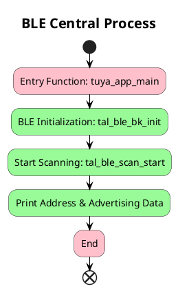

# BLE CENTRAL

## Introduction

This project demonstrates how to use `tuyaos 3 ble central` APIs to enable Bluetooth Central mode and scan for nearby Bluetooth devices.

* Peripheral and Central Devices

Peripheral and Central devices are also known as Slave and Master. Due to political sensitivity around the terms "slave/master", Bluetooth SIG adopted Peripheral/Central terminology.

| Mode | Description |
|------|-------------|
| Peripheral | A device that accepts physical connection requests during Bluetooth pairing (e.g., a Bluetooth headset in pairing mode). |
| Central | A device that initiates connection requests (e.g., a smartphone connecting to headphones). |

* Bluetooth Device Addresses

**Public Device Address**:  
A globally unique MAC address purchased from IEEE (similar to network MAC addresses).

**Random Device Address**:  
Introduced for BLE to address cost and scalability issues. Two main types:

1. **Static Device Address**  
   - Top 2 bits: "11"  
   - Remaining 46 bits: Random number (not all 0s/1s)  
   - Remains constant during power cycle  
   - May change after reboot  

2. **Private Device Address**  
   - **Non-resolvable**: Changes periodically (every 15min)  
   - **Resolvable**: Generated using IRK (Identity Resolving Key) for privacy:  
     - Top 2 bits: "10"  
     - Requires pairing with Public/Static address  
     - Prevents device tracking  


* Advertising Packet

Bluetooth advertising packets contain up to 31 bytes divided into:
1. **Valid Data**: Multiple AD Structures (LEN=TYPE+DATA lengths)
2. **Padding**: Filled with 0s if <31 bytes

Common AD Types defined in [Bluetooth Spec](https://www.bluetooth.com/wp-content/uploads/Files/Specification/HTML/Assigned_Numbers/out/en/Assigned_Numbers.pdf?v=1717394055448) section 2.3.


* RSSI (Received Signal Strength Indicator)

Negative dBm values representing signal strength:
- 0dBm = 1mW  
- -70dBm = 0.1nW  

## Workflow



## Output
Device Address:Most devices use Static Device Address (0x14=0b1110 in header):
```c
[01-01 00:00:58 TUYA D][lr:0x4aab3] ----------bluetooth event callback-------
[01-01 00:00:58 TUYA D][lr:0x4aabb] bluetooth event is : 5
Scanf device peer addr:   14  82  134  82  129  59 
[01-01 00:00:58 TUYA D][lr:0x4aaf3] Peer addr type is random address
```

RSSI Measurement:
```c
[01-01 00:00:58 TUYA D][lr:0x4ab1d] Received Signal Strength Indicator : -64
```
Advertising Packet Analysis:
```c
[01-01 00:00:06 TUYA D][lr:0x4ab23] Advertise packet data length : 31
Advertise packet data:
0x05,0x09,0x31,0x32,0x33,0x34,0x02,0x0A,0x08,0x15,0xFF,0x41,0x50,0x50,0x4C,0x45,0x06,0x00,0x01,0x09,0x32,0x02,0xA1,0x59,0x36,0x5B,0x9C,0x8F,0xFA,0x9A,0x7D
```

Using the AD Structure formula `len = type + data`, we parse the advertising packet into three AD Structures:
The first byte 0x05 indicates the length of the first AD Structure. For advertising packet type definitions, refer to the official Bluetooth specifications in [GAP section 3.4](https://www.bluetooth.com/specifications/assigned-numbers/generic-access-profile/). 
The type value 0x09 corresponds to _Complete Local Name_ using UTF-8 encoding. Analyzing the data bytes 0x31,0x32,0x33,0x34:
This confirms the device name in the first AD Structure is "1234".


The second `AD Structure` has only two values, `type` and `data`. 0x0A is the transmit power, and the data is 0x08. So the second `AD Structure` tells us that the Bluetooth transmit power is 8.


The third `AD Structure` has a length of 0x15 and a type of 0xFF. This type is special and is the custom data of the Bluetooth manufacturer. The remaining data is the manufacturer's custom data.


## Support

You can get support from Tuya through:

- TuyaOS Forum： https://www.tuyaos.com

- Developer Portal: https://developer.tuya.com

- Help Center: https://support.tuya.com/help

- Technical Support Tickets: https://service.console.tuya.com
