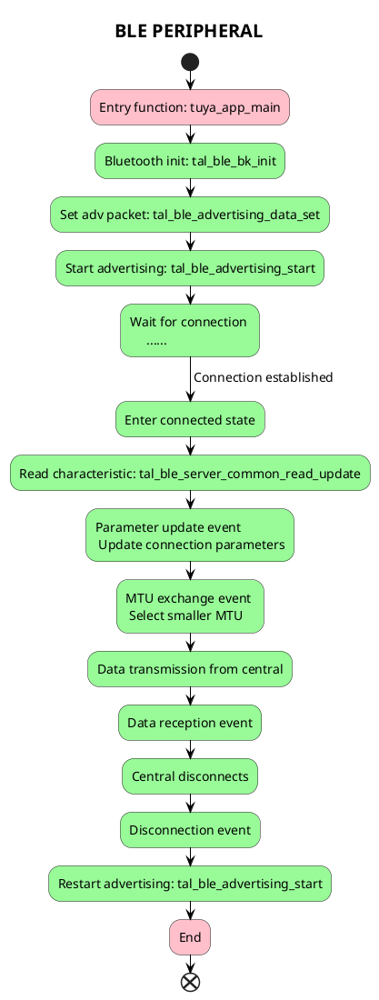

# BLE PERIPHERAL

## Introduction

This project will demonstrate how to use the `tuyaos 3 ble peripheral` related interfaces to enable Bluetooth peripheral mode (slave mode), allowing a smartphone acting as a central device (master mode) to connect to this Bluetooth device.

* Peripheral and Central Devices

Peripheral and central devices are also called slave and master. However, the terms "slave" and "master" involve sensitive political topics abroad, so recent Bluetooth versions use peripheral and central devices instead.
| Mode | Description |
| ---- | ---- |
| Peripheral | A device that accepts physical connection requests during Bluetooth pairing is defined as a Peripheral. |
| Central | A device that initiates physical connection requests during Bluetooth pairing is defined as a Central. |

When your Bluetooth earphones enter pairing mode and wait for a smartphone connection, the earphones act as a peripheral and the phone acts as a central.

Bluetooth devices periodically broadcast data packets at fixed intervals. Nearby devices can receive these packets periodically.

There are four basic types of BLE advertising packets:

| Advertising Packet | Description |
|---|---|
| Connectable Undirected | Accepts scan requests (if actively scanned) and connection requests. |
| Connectable Directed | Only accepts connection requests from specific devices, typically containing only the broadcaster's and initiator's addresses for fast connections. |
| Non-connectable Undirected | Does not accept scan or connection requests. |
| Scannable Undirected | Accepts scan requests to provide additional information but rejects connection requests. |

The advertising data format is shown below. `LEN` indicates the length of the field (TYPE+VALUE). `TYPE` refers to data types defined in `GAP` (Generic Access Profile).


* Parameter Update

Parameter update refers to adjusting connection parameters (Connection Interval, Timeout, Effective Connection Interval, etc.) after two devices connect. Only the central device can initiate this process.

* MTU Exchange

MTU (Maximum Transmission Unit) defines the maximum data size in a PDU (Protocol Data Unit). The central declares its MTU, the peripheral responds with its MTU, and both use the smaller value. The central initiates MTU exchange after connection.

* Characteristics, Services, and Profiles

Bluetooth profiles define application scenarios (e.g., a heart rate monitor). Each profile contains one or more services (e.g., heart rate service), and each service includes characteristics (e.g., heart rate measurement). Characteristics contain multiple ATT (Attribute Protocol) entries, represented as structs in code.


* Bluetooth States

Main states include: Initialization, Connected, Advertising, Scanning, and Idle. Scanning is exclusive to central devices.


## Workflow



## Output
`Ble` Initialization event. Bluetooth starts advertising and waits for central device connection.

```c
[01-01 00:00:00 ty D][example_ble_peripheral.c:64] ----------ble_peripheral event callback-------
[01-01 00:00:00 ty D][example_ble_peripheral.c:65] ble_peripheral event is : 1
[01-01 00:00:00 ty D][example_ble_peripheral.c:68] init Ble/Bt stack and start advertising.
```

Open the `nRF connect` [APP](https://play.google.com/store/apps/details?id=no.nordicsemi.android.mcp&hl=en&gl=US), scan for the Bluetooth device named `TY`, and click to connect.

`BLE` enters connection event and reads characteristic value.

```c
[01-01 00:00:23 ty D][example_ble_peripheral.c:64] ----------ble_peripheral event callback-------
[01-01 00:00:23 ty D][example_ble_peripheral.c:65] ble_peripheral event is : 3
[01-01 00:00:23 ty D][example_ble_peripheral.c:85] ble_peripheral starts to connect...
[01-01 00:00:23 ty I][tkl_bluetooth.c:1156] char handle = 0x08
```

After `BLE` enters connected state, the central device will actively initiate connection parameter updates and `MTU` exchange.

`BLE` connection parameter update event occurs.

```c
[01-01 00:00:24 ty D][example_ble_peripheral.c:64] ----------ble_peripheral event callback-------
[01-01 00:00:24 ty D][example_ble_peripheral.c:65] ble_peripheral event is : 8
[01-01 00:00:24 ty D][example_ble_peripheral.c:110] Parameter update successfully!
[01-01 00:00:24 ty D][example_ble_peripheral.c:112] Conn Param Update: Min = 7.500000 ms, Max = 7.500000 ms, Latency = 0, Sup = 5000 ms
```

`BLE` enters `MTU` exchange request event.

```c
[01-01 00:07:13 TUYA D][lr:0x4aa47] ----------bluetooth event callback-------
[01-01 00:07:13 TUYA D][lr:0x4aa4f] bluetooth event is : 9
[01-01 00:07:13 TUYA D][lr:0x4ab57] MTU exchange request event.
[01-01 00:07:13 TUYA D][lr:0x4ab5f] Get Response MTU Size = 256
```

Open the `nRF connect` APP on your smartphone, the central device sends data `0x1111` to the peripheral.

`BLE` enters data reception event.

```c
[01-01 00:02:09 ty D][example_ble_peripheral.c:64] ----------ble_peripheral event callback-------
[01-01 00:02:09 ty D][example_ble_peripheral.c:65] ble_peripheral event is : 13
[01-01 00:02:09 ty D][example_ble_peripheral.c:125] Get Device-Write Char Request
[01-01 00:02:09 ty D][example_ble_peripheral.c:127] devicr send  data[0]: 16
[01-01 00:03:48 ty D][example_ble_peripheral.c:64] ----------ble_peripheral event callback-------
[01-01 00:03:48 ty D][example_ble_peripheral.c:65] ble_peripheral event is : 13
[01-01 00:03:48 ty D][example_ble_peripheral.c:125] Get Device-Write Char Request
[01-01 00:03:48 ty D][example_ble_peripheral.c:127] devicr send  data[0]: 17
```

Open the `nRF connect` APP on your smartphone, the central device disconnects and the peripheral restarts advertising.

`BLE` enters disconnection event.

```c
[01-01 00:05:39 ty D][example_ble_peripheral.c:64] ----------ble_peripheral event callback-------
[01-01 00:05:39 ty D][example_ble_peripheral.c:65] ble_peripheral event is : 5
[01-01 00:05:39 ty D][example_ble_peripheral.c:105] ble_peripheral disconnect.
[01-01 00:05:39 ty N][ble_gap.c:2509] Start Adv
```

## Support

You can get support from Tuya through:

- TuyaOS Forum： https://www.tuyaos.com

- Developer Portal: https://developer.tuya.com

- Help Center: https://support.tuya.com/help

- Technical Support Tickets: https://service.console.tuya.com
