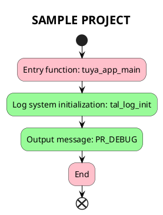

# SAMPLE PROJECT

## Introduction

This project will demonstrate how to use the `tuyaos 3 log` related interfaces to enable logging functionality and output `hello world` using serial port redirection.

- Logging System

The TuyaOS logging system includes log records for various levels (error, warning, info, debug, and trace). It supports conditional compilation of log output levels, custom log buffer sizes, and printf-style log messages. Additionally, it provides hexadecimal dump logging, global log level configuration, and management of log message output destinations. The logging feature is designed to assist development and debugging by providing comprehensive, flexible, and configurable logging capabilities. It allows developers to control the verbosity of log outputs and direct them to different destinations such as serial ports or files according to application needs.

- Log Levels

TuyaOS provides six log levels for users to print information, each with macro functions that work like printf:

```c
#define PR_ERR(fmt, ...)    tal_log_print(TAL_LOG_LEVEL_ERR, _THIS_FILE_NAME_, __LINE__, fmt, ##__VA_ARGS__)
#define PR_WARN(fmt, ...)   tal_log_print(TAL_LOG_LEVEL_WARN, _THIS_FILE_NAME_, __LINE__, fmt, ##__VA_ARGS__)
#define PR_NOTICE(fmt, ...) tal_log_print(TAL_LOG_LEVEL_NOTICE, _THIS_FILE_NAME_, __LINE__, fmt, ##__VA_ARGS__)
#define PR_INFO(fmt, ...)   tal_log_print(TAL_LOG_LEVEL_INFO, _THIS_FILE_NAME_, __LINE__, fmt, ##__VA_ARGS__)
#define PR_DEBUG(fmt, ...)  tal_log_print(TAL_LOG_LEVEL_DEBUG, _THIS_FILE_NAME_, __LINE__, fmt, ##__VA_ARGS__)
#define PR_TRACE(fmt, ...)  tal_log_print(TAL_LOG_LEVEL_TRACE, _THIS_FILE_NAME_, __LINE__, fmt, ##__VA_ARGS__)
```

## Workflow



## Output

Successfully outputs 'hello world' with timestamp, log level, filename, line number, and other information.

```c
[01-01 00:00:00 ty D][sample_project.c:37] hello world
[01-01 00:00:00 ty D][sample_project.c:43] cnt is 1
[01-01 00:00:00 ty D][sample_project.c:51] cnt is 10
```

## Support

You can get support from Tuya through:

- TuyaOS Forum： https://www.tuyaos.com

- Developer Portal: https://developer.tuya.com

- Help Center: https://support.tuya.com/help

- Technical Support Tickets: https://service.console.tuya.com
