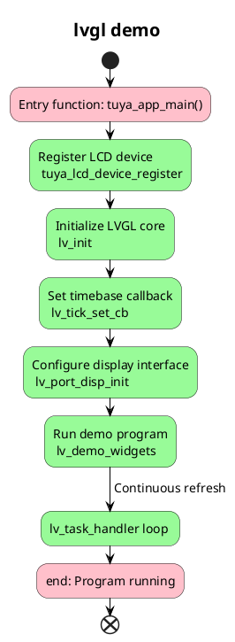

# lvgl_demo

## Overview
This project is a demonstration of the LVGL library, a lightweight graphics library for embedded systems. It provides a simple and efficient way to create graphical user interfaces (GUIs) for embedded devices. The library is designed to be easy-to-use and highly efficient, making it ideal for resource-constrained environments.

## Supported Platforms & Interfaces
- [ ] T3: SPI
- [x] T5AI: RGB/8080/SPI
- [ ] ESP32

## Supported Drivers
### Displays
- SPI
    - [x] ST7789 
    - [x] ILI9341
    - [x] GC9A01

- RGB
    - [x] ILI9488

### Touch
- I2C
    - [x] GT911
    - [x] CST816
    - [x] GT1511

### Rotary Encoder

## Supported Development Boards
| Board | Screen Interface & Driver | Touch Interface & Driver | Touch Pins | Remarks |
| -------- | -------- | -------- | -------- | -------- |
| T5AI_Board | RGB565/ILI9488 | I2C/GT1511 | SCL(P13)/SDA(P15) | [https://developer.tuya.com/cn/docs/iot-device-dev/T5-E1-IPEX-development-board?id=Ke9xehig1cabj](https://developer.tuya.com/cn/docs/iot-device-dev/T5-E1-IPEX-development-board?id=Ke9xehig1cabj) |

> More driver adaptations in testing...

## Usage Flow
1. Run `tos menuconfig` to configure project

2. Configure display/touch/rotary encoder drivers

3. Configure corresponding GPIO pins

4. Compile project

5. Flash and run

## Workflow

## Output

## Support

You can get support from Tuya through:

- TuyaOS Forum： https://www.tuyaos.com

- Developer Portal: https://developer.tuya.com

- Help Center: https://support.tuya.com/help

- Technical Support Tickets: https://service.console.tuya.com
