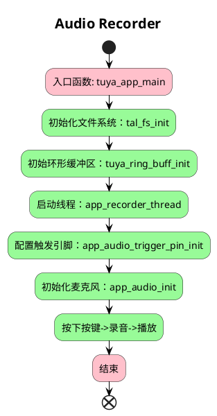

# Audio_Recorder

## 简介

Microphone（麦克风）是一种常见的输入设备，用于将声音信号转换为电信号。本 demo 演示了如何从麦克风中采集音频数据，并将其保存到内部 flash 或 SD 卡中。

## 功能

本示例代码展示了如何初始化麦克风、采集音频数据并将其保存到指定存储介质中。主要功能包括：

1. 初始化麦克风和音频系统。
2. 配置音频采样率（为了喇叭可以直接播放 MIC 接收到的音频，采样率只支持 8kHz 或 16kHz）、采样位数（16 位）和通道（1通道）。
3. 通过 GPIO 引脚检测音频触发信号。
4. 使用环形缓冲区存储音频数据。
5. 将音频数据保存到内部 flash 或 SD 卡中。
6. 从存储介质中读取音频数据并播放。

## 文件结构

- `example_recorder.c`：主代码文件，包含麦克风初始化、音频采集和存储的实现。

## 使用方法

1. 确保硬件连接正确，麦克风和 SD 卡已连接到开发板。
2. 配置项目中的 `config` 文件，启用 `CONFIG_FATFS` 以支持 SD 卡文件系统。
3. 编译并烧录代码到开发板。
4. 运行程序，按下音频触发按钮开始录音，松开按钮停止录音并开始播放录音。

## 关于 PCM 和 WAV
wav 格式 只需要在 PCM 前面加上 wav 头即可，wav 头可以参考下图：

## 流程介绍

## 注意事项

- 确保 SD 卡已正确格式化，并且有足够的存储空间。
- 根据实际硬件配置，调整 GPIO 引脚和音频参数。
- 录音时长受限于环形缓冲区大小和存储介质的可用空间。
- 该 example 目前仅用 T5AI。

## 技术支持

您可以通过以下方法获得涂鸦的支持:

- TuyaOS 论坛： https://www.tuyaos.com

- 开发者中心： https://developer.tuya.com

- 帮助中心： https://support.tuya.com/help

- 技术支持工单中心： https://service.console.tuya.com
