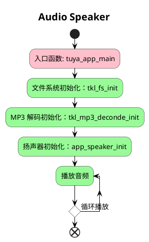

# Audio_Speaker

## 简介

Speaker（扬声器）是一种常见的输出设备，用于将电信号转换为声音信号。本 demo 演示了如何从代码数组和内部 flash 中读取 mp3 文件，然后每 3s 会进行一次 MP3 解码播放。使用的 MP3 音频文件应和设置的 spk_sample 一致， 可以使用 https://convertio.co/zh/ 网站在线进行音频格式和频率转换。


## 使用方法

### 1. 使用代码中的 MP3 文件

将 `MP3_FILE_SOURCE` 宏修改如下：

```c
#define MP3_FILE_SOURCE     USE_C_ARRAY
```

### 2. 声音调节

声音调节函数为：

```c
OPERATE_RET tkl_ao_set_vol(INT32_T card, TKL_AO_CHN_E chn, VOID *handle, INT32_T vol);
```

通过设置 `vol` 进行参数修改。如：30% 音量配置如下：

```c
tkl_ao_set_vol(TKL_AUDIO_TYPE_BOARD, 0, NULL, 30);
```

## 流程介绍


## 技术支持

您可以通过以下方法获得涂鸦的支持:

- TuyaOS 论坛： https://www.tuyaos.com

- 开发者中心： https://developer.tuya.com

- 帮助中心： https://support.tuya.com/help

- 技术支持工单中心： https://service.console.tuya.com
