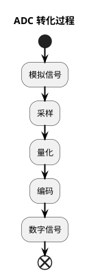
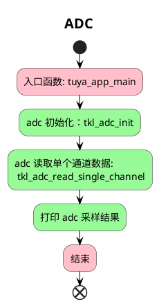

# ADC

该项目将会介绍如何使用 `tuyaos 3 adc ` 相关接口，获取 `adc` 采集到的值。

## 简介
  
`ADC`（` Analog-to-Digital Converter` ），中文名模拟数字转换器，也称 `AD` 转换器。信号分为模拟信号和数字信号，自然界中大多数信号都是模拟信号，其特点是连续的，可以在范围内任意变化。但连续的模拟信号并不适合计算机的计算，因此需要使用AD转换器将连续的模拟信号转化为离散的数字信号，这样信号就可以存储在计算机中并进行计算。
* `ADC` 参数：

| 参数           | 意义 |
| -----------    | ----------- |
| 分辨率         | ADC的采样精度，通常用Bit表示，常见有8位，12位，16位。位数越高，采样精度越高      |
|  采样率        | 表示ADC采样的速率，通常以每秒采样次数（samples per second，SPS）表示|
|采样范围        |指输入信号的电压范围，超过范围可能损坏芯片的ADC模块|

* 常见应用

`ADC` 常见的应用是将连续变化的电压值转换为数字量。通俗易懂的说法，可以用来采集电压。本例程将介绍如何使用 `ADC` 读取电压。

* 编程接口
接口详细介绍可在 VS Code 中的 Tuya Wind IDE 中的 [TuyaOS API 文档](https://developer.tuya.com/cn/docs/iot-device-dev/tuyaos-wind-ide?id=Kbfy6kfuuqqu3#title-12-TuyaOS%20%E6%96%87%E6%A1%A3%E5%AF%BC%E8%88%AA)中进行查看。

*  `AD` 转化过程

1. 采样：时间连续、数值连续的模拟信号转化为时间离散、数值离散的信号。
2. 量化：将连续的模拟信号的幅值映射为离散信号中离散的幅值。
3. 编码：将量化后的样本值编码为二进制数据，方便存储、传输、计算。



## 流程介绍



## 运行结果

每调用一次 `example_adc` ，就会将当前采集到的 adc 值打印出来。

```c
[01-01 00:01:34 TUYA D][lr:0x70309] ADC0 value = 4049
```
计算电压：`value / 4096 * VDD`

## 技术支持

您可以通过以下方法获得涂鸦的支持:

- TuyaOS 论坛： https://www.tuyaos.com

- 开发者中心： https://developer.tuya.com

- 帮助中心： https://support.tuya.com/help

- 技术支持工单中心： https://service.console.tuya.com
