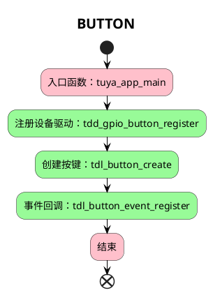

# BUTTON

该项目将会介绍如何使用 `tuyaos 3 button_gpio ` 相关接口，读取按键状态并触发按键事件。

## 简介
  
`button` 是计算机中常用的输入设备，用户可以通过按键对计算机实现信息输入。

* 编程接口
接口详细介绍可在 VS Code 中的 Tuya Wind IDE 中的 [TuyaOS API 文档](https://developer.tuya.com/cn/docs/iot-device-dev/tuyaos-wind-ide?id=Kbfy6kfuuqqu3#title-12-TuyaOS%20%E6%96%87%E6%A1%A3%E5%AF%BC%E8%88%AA)中进行查看。

## 流程介绍



## 运行结果

短按按键，触发 `TDL_BUTTON_PRESS_DOWN` 事件，打印 `single click` 。
长按按键(3s以上)，触发 `TDL_BUTTON_LONG_PRESS_START` 事件，打印 `long press` 。

```c
[01-01 00:00:04 ty N][example_button.c:57] app_button: single click
[01-01 00:00:07 ty N][example_button.c:61] app_button: long press
```

## 技术支持

您可以通过以下方法获得涂鸦的支持:

- TuyaOS 论坛： https://www.tuyaos.com

- 开发者中心： https://developer.tuya.com

- 帮助中心： https://support.tuya.com/help

- 技术支持工单中心： https://service.console.tuya.com
