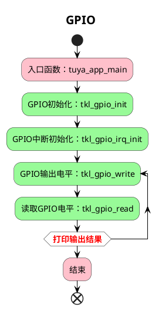

# GPIO

该项目将会介绍如何使用 `tuyaos 3 gpio ` 相关接口，设置 `GPIO` 为输入、输出或中断模式。

相关接口详细介绍可在 VS Code 中的 Tuya Wind IDE 中的 [TuyaOS API 文档](https://developer.tuya.com/cn/docs/iot-device-dev/tuyaos-wind-ide?id=Kbfy6kfuuqqu3#title-12-TuyaOS%20%E6%96%87%E6%A1%A3%E5%AF%BC%E8%88%AA)中进行查看。

## 流程介绍



## 运行结果

读取电平。

```c
[01-01 00:06:18 TUYA D][lr:0x4a98b] GPIO High
```

按下按键，触发 `GPIO` 中断。

```C
[01-01 00:00:42 TUYA D][lr:0x4a9bb] ------------GPIO IRQ Callbcak------------
```

## 技术支持

您可以通过以下方法获得涂鸦的支持:

- TuyaOS 论坛： https://www.tuyaos.com

- 开发者中心： https://developer.tuya.com

- 帮助中心： https://support.tuya.com/help

- 技术支持工单中心： https://service.console.tuya.com
