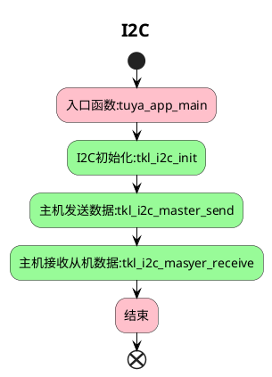

# I2C

##  简介

这个项目将会介绍如何使用 `i2c` 相关接口，配置 `i2c` ，读取温湿度传感器 SHT 30 的温度告警值。

* IIC 简介
  
`IIC（Inter-Integrated Circuit）`，中文名集成电路总线，它是符合 `IIC` 协议的串行通讯总线。一般两根线，一根是双向的数据线 `SDA`，另一根也是双向的时钟线 `SCL`，它们都通过一个电流源或上拉电阻连接到正的电源电压。

* 主机和从机

连接到总线上的器件分主机和从机。主机是产生起始条件、产生时钟信号、产生结束条件的器件；从机是被主机寻址的器件。在本例程中，运行此例程的设备就是主机，温湿度传感器就是从机。

* `IIC` 7位地址

在7位寻址过程中，从机地址在启动信号后的第一个字节开始传输，该字节的前7位为从机地址，第8位为读写位，其中0表示写，1表示读。


  
* `IIC` 8位地址

一些厂商说的是8位地址，实际上是把读写位也算进去了，例如写地址0x92，读地址0x93。但是从机地址还是前7位。


* `IIC` 10位地址

10位地址会占用2个字节。

前7位是 `1111 0xx` ，后面两位 `xx` 是10位地址的2个最高有效位。第1个字节的第8位是读写位。第2个字节用于多个从设备应答的情况。


* 程序接口
相关接口详细介绍可在 VS Code 中的 Tuya Wind IDE 中的 [TuyaOS API 文档](https://developer.tuya.com/cn/docs/iot-device-dev/tuyaos-wind-ide?id=Kbfy6kfuuqqu3#title-12-TuyaOS%20%E6%96%87%E6%A1%A3%E5%AF%BC%E8%88%AA)中进行查看。

## 流程介绍



## 运行结果
i2c 读取温湿度传感器告警值。
```
[01-01 00:06:58 TUYA D][lr:0x4a980] The alarm value you set is = 60
```

## 技术支持

您可以通过以下方法获得涂鸦的支持:

- TuyaOS 论坛： https://www.tuyaos.com

- 开发者中心： https://developer.tuya.com

- 帮助中心： https://support.tuya.com/help

- 技术支持工单中心： https://service.console.tuya.com
