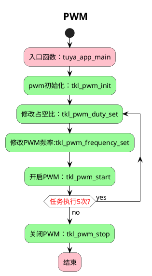

# PWM

## 简介

这个项目将会介绍如何使用 `tuyaos 3 pwm ` 相关接口，设置 `pwm` 波形。

* `PWM` 简介

脉冲宽度调制( `PWM` )，是英文`“Pulse Width Modulation”`的缩写。是通过将有效的电信号分散成离散形式从而来降低电信号所传递的平均功率的一种方式。

* 占空比、频率、周期

周期（T）：T = Ton + Toff

频率（f）：f = 1/T

占空比（D）：Ton/（Ton+Toff）

## 流程介绍

## 技术支持

您可以通过以下方法获得涂鸦的支持:

- TuyaOS 论坛： https://www.tuyaos.com

- 开发者中心： https://developer.tuya.com

- 帮助中心： https://support.tuya.com/help

- 技术支持工单中心： https://service.console.tuya.com
