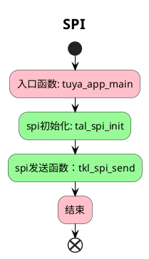

# SPI

##  简介

这个项目将会介绍如何使用 `tuyaos 3 spi ` 相关接口，主机发发送，从机接受。

* `SPI` 简介
  
`SPI`（ `Serial Peripheral Interface` ）,是一种高速全双工的通信总线。

* `SPI` 模式

`SPI` 有四种操作模式，每种模式由两个参数描述，称为时钟极`CPOL`（ `clock polarity` ）与时钟期`CPHA`（ `clock phase` ）。

`CPOL` =0表示 `SCK`在空闲状态时为0；

`CPOL` =1表示 `SCK`在空闲状态时为1；

`CPHA` =0表示 在 `SCK` 第一个边沿时输入输出数据有效；

`CPHA` =1表示 在 `SCK` 第二个边沿时输入输出数据有效；

* 主机和从机

提供时钟的为主设备（ `Master` ），接收时钟的设备为从设备（ `Slave` ）， `SPI` 接口的读写操作，都是由主设备发起。当存在多个从设备时，通过各自的片选信号进行管理。

## 流程介绍

## 运行结果

主机使用 SPI 发送 `"hello world" `。

## 技术支持

您可以通过以下方法获得涂鸦的支持:

- TuyaOS 论坛： https://www.tuyaos.com

- 开发者中心： https://developer.tuya.com

- 帮助中心： https://support.tuya.com/help

- 技术支持工单中心： https://service.console.tuya.com
