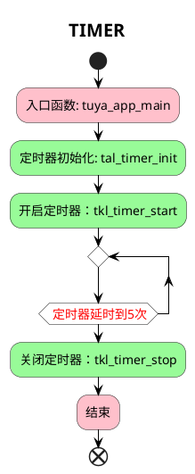

# TIMER

##  简介

这个项目将会介绍如何使用 `tuyaos 3 timer ` 相关接口，创建一个定时器，延时时间到5次之后关闭释放定时器。

## 流程介绍

<!--  -->



## 运行结果

定时器中断触发5次后，停止定时器。

```c
[01-01 00:00:08 TUYA N][lr:0x70ab9] timer 0 is start
[01-01 00:00:08 TUYA D][lr:0x70ad5] -------------Timer Callbcak--------------
[01-01 00:00:09 TUYA D][lr:0x70ad5] -------------Timer Callbcak--------------
[01-01 00:00:09 TUYA D][lr:0x70ad5] -------------Timer Callbcak--------------
[01-01 00:00:10 TUYA D][lr:0x70ad5] -------------Timer Callbcak--------------
[01-01 00:00:10 TUYA D][lr:0x70ad5] -------------Timer Callbcak--------------
[01-01 00:00:10 TUYA N][lr:0x70af7] timer 0 is stop
```
## 技术支持

您可以通过以下方法获得涂鸦的支持:

- TuyaOS 论坛： https://www.tuyaos.com

- 开发者中心： https://developer.tuya.com

- 帮助中心： https://support.tuya.com/help

- 技术支持工单中心： https://service.console.tuya.com
