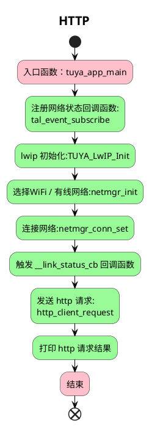

# HTTP  简介
`HTTP`  (`HyperText Transfer Protocol`)，即超文本运输协议，是实现网络通信的一种规范协议（应用层协议），在可靠地网络层协议（`TCP/IP`）的基础上提供了在 `Web` 服务器和客户机之间传输信息的一种机制。并规定了两者之间信息交互的信息格式。

使用 `HTTP` 通信的时候，一条线路上必然有一端是客户端，另一段是服务端；在实际应用中， `HTTP` 常被用于在Web浏览器和网站服务器之间传递信息，以明文方式发送内容，不提供任何方式的数据加密。

`example_http` 例程演示了如何使用原生`http` 接口。

## 流程介绍



## 运行结果
```c
[01-01 14:58:54 ty D][lr:0xadbd3] Connect: httpbin.org Port: 80  -->>
[01-01 14:58:54 ty D][lr:0x7a689] unw_gethostbyname httpbin.org, prio 1
[01-01 14:58:54 ty D][lr:0x7a7b5] use dynamic dns ip:44.194.147.17 for domain:httpbin.org
[01-01 14:58:54 ty D][lr:0xbc05d] bind ip:c0a81cc2 port:0 ok
[01-01 14:58:54 ty D][lr:0xadbed] Connect: httpbin.org Port: 80  --<< ,r:0
[01-01 14:58:54 ty I][example_http.c:126] rsp:{
  "args": {}, 
  "headers": {
    "Host": "httpbin.org", 
    "User-Agent": "TUYA_IOT_SDK", 
    "X-Amzn-Trace-Id": "Root=1-65308a26-2d1b68cd71ac3ac235a5020a"
  }, 
  "origin": "124.90.34.126", 
  "url": "h[01-01 14:58:54 ty D][lr:0xbc0fd] tcp transporter close socket fd:4
```
返回内容较多，日志只能显示前1K数据。

## 技术支持

您可以通过以下方法获得涂鸦的支持:

- TuyaOS 论坛： https://www.tuyaos.com

- 开发者中心： https://developer.tuya.com

- 帮助中心： https://support.tuya.com/help

- 技术支持工单中心： https://service.console.tuya.com
