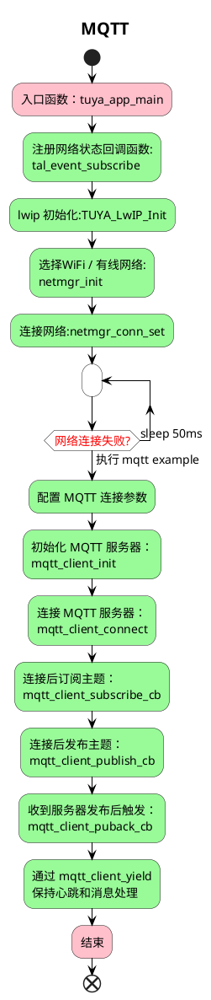

# MQTT  简介
`MQTT` (消息队列遥测传输)是 `ISO` 标准 `(ISO/IEC PRF 20922)` 下基于发布/订阅范式的消息协议。它工作在 `TCP/IP` 协议族上，是为硬件性能低下的远程设备以及网络状况糟糕的情况下而设计的发布/订阅型消息协议，为此，它需要一个消息中间件 。
MQTT协议运行在 TCP/IP，因TCP/IP提供了有序、可靠、双向连接的网络连接。MQTT是一个由IBM主导开发的物联网传输协议，它被设计用于轻量级的发布/订阅式消息传输，旨在为低带宽和不稳定的网络环境中的物联网设备提供可靠的网络服务。它的核心设计思想是开源、可靠、轻巧、简单，具有以下主要的几项特性：

1. 非常小的通信开销（最小的消息大小为 2 字节）；

2. 支持各种流行编程语言（包括C，Java，Ruby，Python 等等）且易于使用的客户端；

3. 支持发布 / 预定模型，简化应用程序的开发；
4. 提供三种不同消息传递等级，让消息能按需到达目的地，适应在不稳定工作的网络传输需求。

通过对比传统的HTTP、MQ协议，可以直观的看出MQTT在应用中使用广泛。
|协议               |HTTP|MQTT|
|-------------------|----|----|
|消息传输方式       |请求/响应|发布/订阅|
|消息传递等级       |至多一次|至多一次|
|机密性             |是|是|
|低协议开销          |否|是|
|对不稳定网络的容忍  |否|是|
|低功耗             |否|是|
|数百万连接的客户    |否|是|


 `example_mqtt` 例程演示了如何使用原生 `mqtt` 接口。

## 流程介绍


## 运行结果

```c
[01-02 04:09:16 ty D][examples_mqtt_client.c:122] start mqtt client to broker.emqx.io
[01-02 04:09:16 ty N][netconn_wired.c:43] wired status changed to 1, old stat: 1
[01-02 04:09:16 ty D][netmgr.c:113] netmgr status changed to 1, old 1, active 2
[01-02 04:09:17 ty D][tcp_transporter.c:102] bind ip:00000000 port:0 ok
[01-02 04:09:17 ty I][examples_mqtt_client.c:66] mqtt client connected! try to subscribe tuya/tos-test
[01-02 04:09:17 ty D][examples_mqtt_client.c:71] Subscribe topic tuya/tos-test ID:1
[01-02 04:09:18 ty D][mqtt_client_wrapper.c:58] MQTT_PACKET_TYPE_SUBACK id:1
[01-02 04:09:18 ty D][examples_mqtt_client.c:89] Subscribe successed ID:1
[01-02 04:09:18 ty D][examples_mqtt_client.c:95] Publish msg ID:2
[01-02 04:09:18 ty D][mqtt_client_wrapper.c:72] MQTT_PACKET_TYPE_PUBACK id:2
[01-02 04:09:18 ty D][examples_mqtt_client.c:100] PUBACK successed ID:2
[01-02 04:09:18 ty D][examples_mqtt_client.c:101] UnSubscribe topic tuya/tos-test
[01-02 04:09:18 ty D][examples_mqtt_client.c:84] recv message TopicName:tuya/tos-test, payload len:32
```


## 技术支持

您可以通过以下方法获得涂鸦的支持:

- TuyaOS 论坛： https://www.tuyaos.com

- 开发者中心： https://developer.tuya.com

- 帮助中心： https://support.tuya.com/help

- 技术支持工单中心： https://service.console.tuya.com
