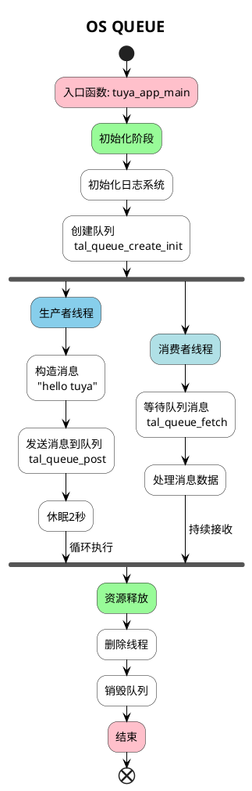

# SYSTEM QUEUE

##  简介

该示例会在开始的时候创建两个线程， `__queue_post_task` 和 `__queue_fetch_task` ，`__queue_post_task` 线程会每隔 5s 就回向队列中释放一条数据，`__queue_fetch_task` 线程一直阻塞着等待着队列中有数据到来，然后打印从队列中取出来的数据。

## 流程介绍


## 运行结果
```C
[01-01 00:00:13 ty D][tal_thread.c:203] Thread:queue_post Exec Start. Set to Running Stat
[01-01 00:00:13 ty N][example_queue.c:51] post queue
[01-01 00:00:13 ty I][tal_thread.c:184] thread_create name:queue_post,stackDepth:1024,totalstackDepth:26112,priority:3
[01-01 00:00:13 ty D][tal_thread.c:203] Thread:queue_fetch Exec Start. Set to Running Stat
[01-01 00:00:13 ty N][example_queue.c:65] get queue, data: hello tuya

[01-01 00:00:13 ty I][tal_thread.c:184] thread_create name:queue_fetch,stackDepth:1024,totalstackDepth:27136,priority:3
[01-01 00:00:15 ty D][lr:0x8a455] feed watchdog
[01-01 00:00:18 ty N][example_queue.c:51] post queue
[01-01 00:00:18 ty N][example_queue.c:65] get queue, data: hello tuya

[01-01 00:00:23 ty N][example_queue.c:51] post queue
[01-01 00:00:23 ty N][example_queue.c:65] get queue, data: hello tuya
```

## 技术支持
您可以通过以下方法获得涂鸦的支持:
* [开发者中心](https://developer.tuya.com)
* [帮助中心](https://support.tuya.com/help)
* [技术支持帮助中心](https://service.console.tuya.com)
* [Tuya os](https://developer.tuya.com/cn/tuyaos)
