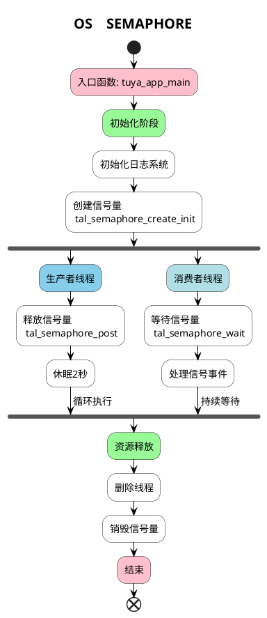

# SYSTEM SEMAPHORE

##  简介

该示例会在开始的时候创建两个线程， `__sema_post_task` 和 `__sema_wait_task` ，`__sema_post_task` 线程会每隔 5s 就释放一个信号量，`__sema_wait_task` 线程一直阻塞着等待着信号量的到来。

## 流程介绍


## 运行结果

```c
[01-01 00:11:05 ty D][tal_thread.c:203] Thread:sema_post Exec Start. Set to Running Stat
[01-01 00:11:05 ty N][example_semaphore.c:48] post semaphore
[01-01 00:11:05 ty I][tal_thread.c:184] thread_create name:sema_post,stackDepth:1024,totalstackDepth:26112,priority:3
[01-01 00:11:05 ty D][tal_thread.c:203] Thread:sema_wait Exec Start. Set to Running Stat
[01-01 00:11:05 ty N][example_semaphore.c:59] get semaphore
[01-01 00:11:05 ty I][tal_thread.c:184] thread_create name:sema_wait,stackDepth:1024,totalstackDepth:27136,priority:3
[01-01 00:11:10 ty N][example_semaphore.c:48] post semaphore
[01-01 00:11:10 ty N][example_semaphore.c:59] get semaphore
[01-01 00:11:15 ty N][example_semaphore.c:48] post semaphore
[01-01 00:11:15 ty N][example_semaphore.c:59] get semaphore
```

## 技术支持
您可以通过以下方法获得涂鸦的支持:
* [开发者中心](https://developer.tuya.com)
* [帮助中心](https://support.tuya.com/help)
* [技术支持帮助中心](https://service.console.tuya.com)
* [Tuya os](https://developer.tuya.com/cn/tuyaos)
