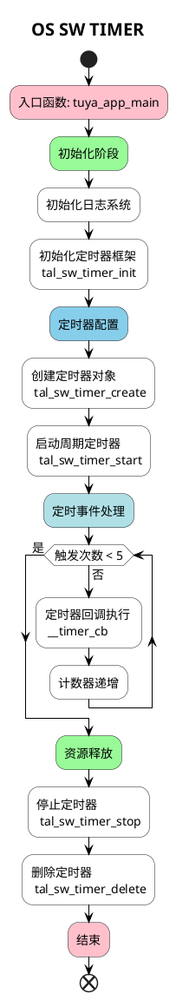

# SYSTEM SW TIMER

##  简介

这个项目将会介绍如何使用 `tuyaos 3 system sw timer` 相关接口，创建一个软件定时器，延时时间到5次之后关闭并释放定时器。

软件定时器通过内核控制，它不需要硬件支持，与底层硬件器无关。

## 流程介绍


## 运行结果
定时器延时时间到5次之后关闭定时器。
```c
[01-01 00:00:07 ty D][example_sw_timer.c:59] sw timer start
[01-01 00:00:10 ty N][example_sw_timer.c:43] --- tal sw timer callback
[01-01 00:00:13 ty N][example_sw_timer.c:43] --- tal sw timer callback
[01-01 00:00:15 ty D][lr:0x8a455] feed watchdog
[01-01 00:00:16 ty N][example_sw_timer.c:43] --- tal sw timer callback
[01-01 00:00:19 ty N][example_sw_timer.c:43] --- tal sw timer callback
[01-01 00:00:22 ty N][example_sw_timer.c:43] --- tal sw timer callback
[01-01 00:00:22 ty N][example_sw_timer.c:46] stop and delete software timer
```


## 技术支持
您可以通过以下方法获得涂鸦的支持:
* [开发者中心](https://developer.tuya.com)
* [帮助中心](https://support.tuya.com/help)
* [技术支持帮助中心](https://service.console.tuya.com)
* [Tuya os](https://developer.tuya.com/cn/tuyaos)
