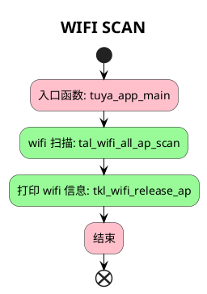

# WIFI SCAN

##  简介

这个项目将会介绍如何使用 `tuyaos 3 wifi scan ` 相关接口，扫描当前 `WiFi` 环境，并打印扫 `WiFi` 的信道号和用户名。

* 常用的 `WiFi` 信息参数
  
|`WiFi` 信息|介绍|
|---|---|
|channel|信道号|
|rssi|信号强度|
|bssid|MAC 地址|
|ssid|WiFi 名称|
|s_len|WiFi 名称长度|
|security|环境类型|

## 流程介绍



## 运行结果
扫描到46个 `WiFi` 信号。
```c
[01-01 00:00:02 TUYA D][lr:0x4b6cb] Scanf to 46 wifi signals
```

展示部分 `WiFi` 的信道号和用户名。
```c
[01-01 00:00:02 TUYA D][lr:0x4b6ed] channel:13, ssid:6F-S-15-04-2.4G
[01-01 00:00:02 TUYA D][lr:0x4b6ed] channel:13, ssid:6F-S-14-14
[01-01 00:00:02 TUYA D][lr:0x4b6ed] channel:1, ssid:Aatrox
[01-01 00:00:02 TUYA D][lr:0x4b6ed] channel:11, ssid:6F-S-15-02
[01-01 00:00:02 TUYA D][lr:0x4b6ed] channel:13, ssid:6F-S-15-03
[01-01 00:00:02 TUYA D][lr:0x4b6ed] channel:6, ssid:6F-S-14-08
[01-01 00:00:02 TUYA D][lr:0x4b6ed] channel:6, ssid:Tuya-Test
[01-01 00:00:02 TUYA D][lr:0x4b6ed] channel:8, ssid:6F-S-14-03
......
```

## 技术支持

您可以通过以下方法获得涂鸦的支持:

- TuyaOS 论坛： https://www.tuyaos.com

- 开发者中心： https://developer.tuya.com

- 帮助中心： https://support.tuya.com/help

- 技术支持工单中心： https://service.console.tuya.com
