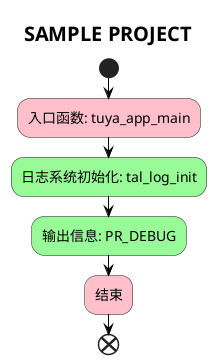

# SAMPLE PROJECT

## 简介

本项目将会介绍如何使用`tuyaos 3 log`相关接口，开启日志功能，使用串口重定向输出`hello world `。

- 日志系统

tuyaos的日志系统包括用于各种级别的日志记录(error, warning, info, debug  and  trace)。它支持对日志输出级别的条件编译，自定义日志缓冲区大小和printf样式的日志消息。此外还提供十六进制转储日志记录、设置全局日志级别以及管理日志消息的终端输出。日志记录功能旨在帮助开发和调试，通过提供全面、灵活和可配置的日志记录功能。它允许开发人员控制对输出日志的详细程度，可以定向到各种输出终端，如串行端口或文件，以满足应用程序的需要。


- 日志级别

tuyaos提供六种日志级别供用户来打印信息，且均提供宏函数便于像printf一样使用。

```c
#define PR_ERR(fmt, ...)    tal_log_print(TAL_LOG_LEVEL_ERR, _THIS_FILE_NAME_, __LINE__, fmt, ##__VA_ARGS__)
#define PR_WARN(fmt, ...)   tal_log_print(TAL_LOG_LEVEL_WARN, _THIS_FILE_NAME_, __LINE__, fmt, ##__VA_ARGS__)
#define PR_NOTICE(fmt, ...) tal_log_print(TAL_LOG_LEVEL_NOTICE, _THIS_FILE_NAME_, __LINE__, fmt, ##__VA_ARGS__)
#define PR_INFO(fmt, ...)   tal_log_print(TAL_LOG_LEVEL_INFO, _THIS_FILE_NAME_, __LINE__, fmt, ##__VA_ARGS__)
#define PR_DEBUG(fmt, ...)  tal_log_print(TAL_LOG_LEVEL_DEBUG, _THIS_FILE_NAME_, __LINE__, fmt, ##__VA_ARGS__)
#define PR_TRACE(fmt, ...)  tal_log_print(TAL_LOG_LEVEL_TRACE, _THIS_FILE_NAME_, __LINE__, fmt, ##__VA_ARGS__)
```

## 流程介绍



## 运行结果
成功输出hello world,并且携带时间、日志等级、文件、行数等信息。

```c
[01-01 00:00:00 ty D][sample_project.c:37] hello world
[01-01 00:00:00 ty D][sample_project.c:43] cnt is 1
[01-01 00:00:00 ty D][sample_project.c:51] cnt is 10
```

## 技术支持

您可以通过以下方法获得涂鸦的支持:

- TuyaOS 论坛： https://www.tuyaos.com

- 开发者中心： https://developer.tuya.com

- 帮助中心： https://support.tuya.com/help

- 技术支持工单中心： https://service.console.tuya.com