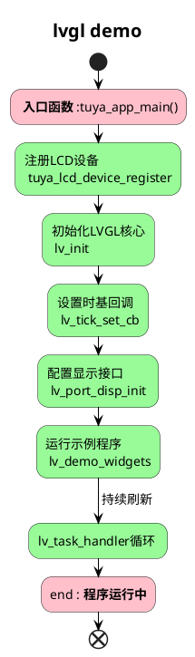

# lvgl_demo

## 概述
该项目是 LVGL 库的演示，LVGL是一个用于嵌入式系统的轻量级图形库。它提供了一种简单高效的方法，为嵌入式系统创建图形用户界面（GUI）。该库设计易于使用且效率高，非常适合在资源受限的环境中使用。

## 支持平台与接口
- [ ] T3：SPI
- [x] T5AI：RGB/8080/SPI
- [ ] ESP32

## 支持驱动
### 屏幕
- SPI
    - [x] ST7789 
    - [x] ILI9341
    - [x] GC9A01

- RGB
    - [x] ILI9488

### 触摸
- I2C
    - [x] GT911
    - [x] CST816
    - [x] GT1511

### 旋转编码器

## 支持开发板列表
| 开发板 | 屏幕接口及驱动 | 触摸接口及驱动 | 触摸管脚 | 备注 |
| -------- | -------- | -------- | -------- | -------- |
| T5AI_Board | RGB565/ILI9488 | I2C/GT1511 | SCL(P13)/SDA(P15) | [https://developer.tuya.com/cn/docs/iot-device-dev/T5-E1-IPEX-development-board?id=Ke9xehig1cabj](https://developer.tuya.com/cn/docs/iot-device-dev/T5-E1-IPEX-development-board?id=Ke9xehig1cabj) |

> 更多驱动适配、测试中...

## 使用流程
1. 运行 `tos menuconfig` 配置工程

2. 配置对应的屏幕/触摸/旋转编码等驱动

3. 配置对应的 GPIO 引脚

4. 编译工程

5. 烧录运行

## 流程介绍

## 运行结果

## 技术支持

您可以通过以下方法获得涂鸦的支持:

- TuyaOS 论坛： https://www.tuyaos.com

- 开发者中心： https://developer.tuya.com

- 帮助中心： https://support.tuya.com/help

- 技术支持工单中心： https://service.console.tuya.com